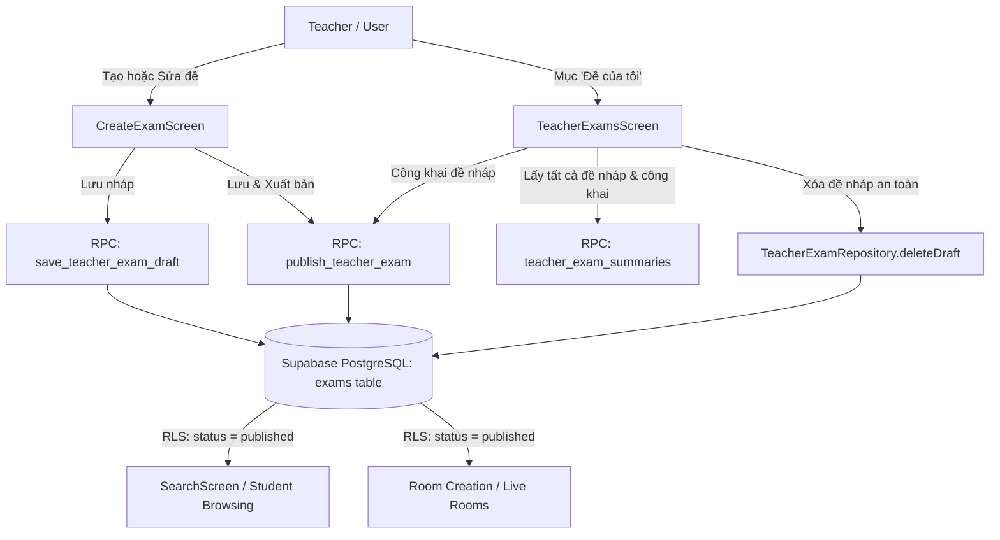

# Đặc tả thiết kế: Quản lý Đề nháp và Công khai đề (Draft & Public Exam Management)

- **Ngày tạo:** 17/09/2026
- **Trạng thái:** Chờ phê duyệt (Pending Review)
- **Tác giả:** Antigravity Agent & Tech Lead

---

## 1. Mục tiêu & Bối cảnh (Executive Summary)

### 1.1 Vấn đề hiện tại
- Giáo viên khi tạo đề trong màn hình Tạo đề (`CreateExamScreen`), bấm nút *"Lưu & Khởi tạo đề"* thì đề chỉ được lưu dưới dạng bản nháp (`status = 'draft'`).
- Do bảng `exams` trong PostgreSQL (Supabase) áp dụng chính sách RLS (Row-Level Security) `create policy "published exams are public" on public.exams for select using (status = 'published');`, các truy vấn trực tiếp dạng `client.from('exams')` từ màn hình danh sách (`TeacherExamsScreen`) và màn hình Tìm kiếm (`SearchScreen`) chỉ trả về các đề `published`.
- Kết quả: Giáo viên vừa soạn đề xong thì không thể kiểm tra, không thấy đề hiển thị ở mục "Đề của tôi", và không có cơ chế nào trên giao diện để công khai (Public) đề đó cho học sinh làm hoặc dùng để tạo phòng thi trực tiếp.

### 1.2 Mục tiêu cần đạt
1. **Quản lý toàn diện tại 1 màn hình chuẩn mực:** Nâng cấp màn hình "Đề của tôi" (`/teacher_exams` trên `TopNavBar`) thành trung tâm quản lý đề thi toàn diện với 3 Tab/Bộ lọc trạng thái: **Tất cả**, **Đề nháp**, và **Đã công khai**, có số lượng badge thời gian thực.
2. **Quy trình Public đề minh bạch:** Hỗ trợ công khai đề nháp trực tiếp từ thẻ đề thông qua Popup Dialog kiểm tra tính hợp lệ và xác nhận; sau khi công khai, tự động chuyển sang tab Đã công khai và gợi ý tạo phòng thi ngay.
3. **Nâng cấp màn hình Tạo đề (`CreateExamScreen`):** Bổ sung nút *"Lưu & Xuất bản ngay"* (Save & Publish) bên cạnh nút *"Lưu nháp"*, kèm cơ chế kiểm tra lỗi từng câu hỏi bằng tiếng Việt thân thiện, thông báo mã đề (`code`) sau khi hoàn tất.
4. **An toàn dữ liệu & Xử lý ngoại lệ:** Hỗ trợ xóa bản nháp an toàn (kèm dialog xác nhận), ngăn chặn xóa đề đã có lượt thi (tránh lỗi khóa ngoại), và hiển thị trạng thái chưa đăng nhập một cách tinh tế.

---

## 2. Phân tích nguyên nhân cốt lõi (Root Cause Analysis)

| Vị trí | Hiện trạng trước đây | Hậu quả |
| :--- | :--- | :--- |
| **`CreateExamScreen`** | Nút lưu gọi `saveDraft()` lưu với `status = 'draft'`. Không có nút Public. | Đề mãi mãi ở trạng thái `'draft'`. |
| **Database RLS (`exams`)** | `select using (status = 'published')` | `client.from('exams')` không trả về bất kỳ dòng nào có `status = 'draft'`. |
| **`TeacherExamsScreen`** | Truy vấn thô bằng `client.from('exams')` thay vì dùng RPC chuyên dụng. | Danh sách đề trống trơn sau khi giáo viên tạo đề nháp. |
| **`SearchScreen`** | Lọc `.eq('status', 'published')` | Học sinh và giáo viên không thể tìm thấy đề vừa tạo. |
| **`ExamDetailScreen`** | Dùng `client.from('exams').eq('id', examId)` và fallback sang đề khác | Mở chi tiết đề nháp bị lỗi hoặc vô tình tải nhầm đề của người khác. |

---

## 3. Kiến trúc hệ thống & Tầng dữ liệu (Architecture & Data Layer)



### 3.1 Nâng cấp `TeacherExamRepository`
- File: `lib/core/repositories/teacher_exam_repository.dart`
- **Cập nhật Model `TeacherExamSummary`:**
  ```dart
  class TeacherExamSummary {
    final String id;
    final String code; // Mã đề hiển thị (ví dụ DT001234)
    final String title;
    final String subject;
    final int durationMinutes;
    final int questionCount;
    final String status; // 'draft' | 'published' | 'archived'
    final DateTime? createdAt;
    
    bool get isDraft => status == 'draft';
    bool get isPublished => status == 'published';
  }
  ```
- **Phương thức Repository:**
  - `summaries()`: Gọi RPC `teacher_exam_summaries` đã có quyền `security definer`, trả về danh sách đề của chính giáo viên sở hữu (không bị chặn bởi RLS public).
  - `publish(String examId)`: Gọi RPC `publish_teacher_exam` để chuyển trạng thái sang `published` và ghi nhận `published_at = now()`.
  - `deleteDraft(String examId)`: Thực hiện xóa đề nháp an toàn thông qua client Supabase (bảng `questions` và `options` tự cascade).
  - `saveDraft(...)`: Lưu cập nhật nội dung đề nháp.
  - `draft(String examId)`: Lấy đầy đủ câu hỏi để chỉnh sửa.

---

## 4. Thiết kế giao diện & Luồng trải nghiệm (UI/UX Design Specs)

### 4.1 Màn hình Quản lý đề thi (`TeacherExamsScreen` tại `/teacher_exams`)

#### A. Header & Bộ điều hướng trạng thái (Segmented Tabs & Statistics)
- **Tiêu đề trang:** `📁 Quản Lý Kho Đề Thi Trắc Nghiệm` kèm nút nổi bật `+ Tạo Đề Thi Mới` dẫn sang `/create_exam`.
- **Hệ thống 3 Tabs chính với Badge đếm số lượng tức thì:**
  1. **Tất cả (N)**: Hiển thị toàn bộ đề mà giáo viên đang có.
  2. **Đề nháp (N)**: Chỉ lọc các đề có `status == 'draft'`. Badge màu cam nhạt/hổ phách (Amber).
  3. **Đã công khai (N)**: Chỉ lọc các đề có `status == 'published'`. Badge màu xanh ngọc (Success Green).
- **Bộ lọc & Tìm kiếm real-time:**
  - Ô tìm kiếm: Tìm tức thì theo cả **Tên đề thi** và **Mã đề thi (VD: DT123456)**.
  - Hàng Filter Chips môn học: `Tất cả môn`, `Toán`, `Vật lý`, `Hóa học`, `Tiếng Anh`,...

#### B. Thẻ đề thi theo ngữ cảnh (Contextual Exam Card)
Mỗi thẻ đề hiển thị đầy đủ thông tin:
- Icon đại diện môn học và tên môn học.
- Tiêu đề đề thi in đậm, rõ ràng.
- Meta info: `Mã đề: DTxxxxxx • N câu hỏi • M phút • Cập nhật lúc ...`.
- Status Badge:
  - `Bản nháp`: Icon cây bút/note, màu cam nhạt.
  - `Đã xuất bản`: Icon quả cầu/public, màu xanh lá cây.
- **Cụm nút thao tác (Action Buttons):**
  - **Với Đề nháp:**
    - Nút chính (Filled Button - Primary): `🚀 Public đề` -> Mở `PublishConfirmDialog`.
    - Nút phụ (Outlined Button): `✏️ Chỉnh sửa` -> Chuyển sang `/create_exam?examId=...`.
    - Nút phụ (Icon Button - Danger): `🗑️ Xóa nháp` -> Mở `DeleteDraftConfirmDialog`.
  - **Với Đề đã công khai:**
    - Nút chính (Filled Button - Primary): `🚪 Tạo Phòng Thi` -> Chuyển sang `/create_room?examId=...`.
    - Nút phụ (Outlined Button): `👁️ Xem chi tiết` -> Mở `/exam_detail?examId=...`.
    - Nút phụ (Outlined Button): `✏️ Chỉnh sửa` -> Mở `/create_exam?examId=...`.

#### C. Hộp thoại xác nhận Xuất bản (`PublishConfirmDialog`)
- **Nội dung hiển thị:**
  - Tóm tắt đề thi: Tên đề, môn học, thời lượng, tổng số câu hỏi.
  - **Danh sách kiểm tra điều kiện (Pre-flight Checks):**
    - [x] Đề đã có ít nhất 1 câu hỏi.
    - [x] Mỗi câu hỏi có ít nhất 2 đáp án lựa chọn.
    - [x] Tiêu đề đề thi hợp lệ (từ 3 ký tự).
  - Thông điệp hướng dẫn: *"Sau khi xuất bản, đề thi sẽ hiển thị trên trang Tìm kiếm của học sinh và bạn có thể mở phòng thi trực tiếp bất kỳ lúc nào."*
- **Hành động:**
  - Nút `Hủy` (Cancel).
  - Nút `Xác nhận Xuất bản` (Confirm Publish) có hiệu ứng loading khi đang gọi RPC.
- **Hành vi sau khi thành công:**
  - Tự động chuyển tab sang `Đã công khai`.
  - Hiển thị SnackBar chúc mừng: *"Đề thi [Tên đề] đã được công khai thành công!"* kèm Action button: `Tạo phòng ngay`.

#### D. Hộp thoại xác nhận Xóa nháp (`DeleteDraftConfirmDialog`)
- Cảnh báo: *"Bạn có chắc chắn muốn xóa bản nháp này không? Toàn bộ các câu hỏi đã soạn sẽ bị xóa vĩnh viễn và không thể khôi phục."*
- Nút `Hủy` và `Xóa vĩnh viễn` (Đỏ).

---

### 4.2 Màn hình Tạo & Soạn đề (`CreateExamScreen` tại `/create_exam`)

#### A. Nâng cấp thanh công cụ dưới cùng (Bottom Action Bar)
- Hiển thị trạng thái lưu: `Chưa lưu nháp` hoặc `Đã lưu nháp lúc hh:mm`.
- Nhóm nút bấm:
  1. Nút `Lưu bản nháp` (OutlinedButton): Lưu dữ liệu vào Supabase dưới dạng `draft`, thông báo SnackBar thành công và giữ nguyên màn hình để giáo viên tiếp tục chỉnh sửa.
  2. Nút `Lưu & Xuất bản ngay` (ElevatedButton - Primary):
     - Kiểm tra toàn bộ tính hợp lệ (Client-side validation).
     - Nếu có câu hỏi trống nội dung hoặc thiếu đáp án: Tự động cuộn/focus đến câu hỏi lỗi đó và hiển thị thông báo cụ thể (VD: *"Câu số 2 chưa có nội dung"*).
     - Nếu hợp lệ: Gọi `saveDraft()` -> Gọi `publish()` -> Hiển thị Dialog thành công:
       - *"Xuất bản đề thi thành công!"*
       - Mã đề: `DTxxxxxx` (có nút sao chép mã đề).
       - Lựa chọn: `Tạo phòng thi với đề này` hoặc `Về danh sách đề của tôi`.

#### B. Xử lý sửa đề đã có lượt thi
- Nếu đề đã công khai và đã có lượt làm bài (`hasAttempts`):
  - Hiển thị cảnh báo: *"Đề thi này đã có học sinh làm bài, không thể chỉnh sửa trực tiếp nội dung để tránh sai lệch kết quả thi cử."*
  - Cung cấp nút `Nhân bản thành đề mới` (Duplicate to Draft) để giáo viên có thể chỉnh sửa trên bản sao mới.

---

## 5. Xử lý các trường hợp ngoại lệ & Biên (Edge Cases & Resilience)

1. **Người dùng chưa đăng nhập:**
   - Nếu chưa đăng nhập mà truy cập `/teacher_exams`: Hiển thị giao diện Empty State thân thiện với icon bảo mật: *"Vui lòng đăng nhập tài khoản Giáo viên để quản lý đề thi và phòng thi"* kèm nút `Đăng nhập`.
2. **Lỗi mạng hoặc Supabase Timeout:**
   - Sử dụng `SupabaseRetryHelper` đã có sẵn trong codebase để retry tự động khi mạng chập chờn.
   - Hiển thị SnackBar lỗi kèm nút `Thử lại`.
3. **Đề thi không thể xóa:**
   - Bắt lỗi foreign key nếu người dùng cố xóa đề đã có phòng/lượt thi: Hiển thị thông báo tiếng Việt: *"Không thể xóa đề thi này vì đã có dữ liệu phòng thi hoặc lượt làm bài liên quan."*

---

## 6. Kế hoạch kiểm thử & Xác minh (Verification & Testing Plan)

### 6.1 Unit & Widget Tests
1. **`test/repositories/teacher_exam_repository_test.dart`**:
   - Kiểm tra parse model `TeacherExamSummary` đầy đủ các trường `status`, `code`, `createdAt`.
   - Kiểm tra gọi `summaries()`, `publish()`, `deleteDraft()`.
2. **`test/screens/teacher_exams_screen_test.dart`**:
   - Kiểm tra render TabBar 3 mục: `Tất cả`, `Đề nháp`, `Đã công khai`.
   - Kiểm tra bộ lọc Tab: chuyển tab Đề nháp chỉ hiện các thẻ có badge Bản nháp.
   - Kiểm tra hiển thị nút `Public đề` trên thẻ đề nháp và mở `PublishConfirmDialog`.
   - Kiểm tra tìm kiếm theo tên và mã đề.
3. **`test/screens/create_exam_screen_test.dart`**:
   - Kiểm tra xuất hiện nút `Lưu bản nháp` và `Lưu & Xuất bản ngay`.
   - Kiểm tra validate câu hỏi trước khi xuất bản.

### 6.2 Manual End-to-End Verification
- Đăng nhập tài khoản.
- Tạo một đề mới qua `CreateExamScreen`, bấm `Lưu bản nháp`.
- Kiểm tra tại `/teacher_exams`: Đề lập tức xuất hiện trong tab `Tất cả` và `Đề nháp`, không bị biến mất như bản cũ.
- Bấm nút `Public đề` từ thẻ đề -> Xác nhận trong Popup -> Đề chuyển trạng thái sang `Đã công khai`.
- Mở `/search` kiểm tra đề đã xuất hiện trên thanh tìm kiếm công khai.
- Tạo một đề mới khác và bấm trực tiếp `Lưu & Xuất bản ngay` từ `CreateExamScreen`.
