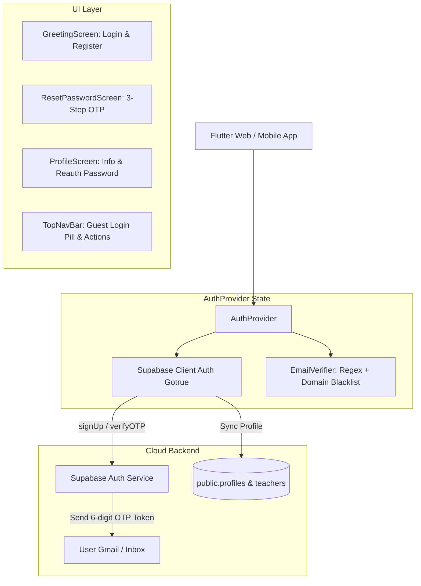

# Design Spec: Native 6-Digit OTP Authentication System for Thi Nhanh

**Date**: 2026-09-27  
**Status**: Approved (Brainstorming Complete)  
**Author**: Antigravity Pair Programming Agent & Project Lead  

---

## 1. Problem Statement & Motivation

### Current Issues:
1. **Broken Link-based Verification & 404 Errors**: When a user registers, Supabase currently sends an English email containing a verification link (`{{ .ConfirmationURL }}`). Clicking this link redirects to `https://ptcutis1tg.github.io/` (missing the `/thi_nhanh/` base path), causing a GitHub Pages 404 Not Found error and invalidating the token.
2. **Security Vulnerabilities in Storage**: `AuthProvider` previously saved user credentials (including plain-text passwords and simulated OTPs) into client-side `SharedPreferences` (`local_registered_users`), exposing them to browser storage inspection or XSS.
3. **Open Database Policy**: Migration `202608300001_user_otps.sql` had an open RLS policy (`for all using (true) with check (true)`), allowing unauthenticated clients to read or overwrite OTP codes.
4. **Unreliable Third-Party OTP Mailer**: `otp_mailer.dart` attempted to send emails via `formsubmit.co`, which requires form owner activation and triggers spam/rate-limit blocks.
5. **Multi-device Reset Lockout**: Password reset in `auth_provider.dart` required the email to exist in the device's local `_registeredUsers` map, completely blocking users from resetting passwords on a new device or incognito browser.
6. **Desynchronized Profile Password Change**: `ProfileScreen.changePassword()` only modified local `SharedPreferences` without calling Supabase Auth API, leaving the real Supabase password unchanged.
7. **Vestigial Role Split Code**: The project has already unified all user accounts (any authenticated account can both take exams and create/author exams). However, legacy code (`UserRole`, `_activeRole`, `setRole`, `updateActiveRole`) still remained in `auth_provider.dart`.

### Goals:
- **100% Native Supabase Auth with 6-Digit OTP**: Replace all confirmation links with direct 6-digit OTP codes for both **Sign-Up** and **Password Reset**.
- **No Confirmation Links**: All verification happens strictly within the app UI using 6-digit numeric input.
- **Secure Token-Based Sessions**: Discard plain-text passwords and local accounts from `SharedPreferences`. Let Supabase Flutter SDK manage secure session storage (`access_token`, `refresh_token`).
- **Clean Unified Account Model**: Purge legacy role switching from `AuthProvider`.
- **Synchronized Profile Password Change**: Re-authenticate current password before updating new password on Supabase Auth.
- **Polished Guest & TopNavBar Experience**: Display a prominent "Đăng nhập" button when unauthenticated, and show a soft modal dialog when guests click authoring/profile features.

---

## 2. Architecture & Design

### 2.1 System Architecture



### 2.2 Key Flows

#### A. Registration with 6-Digit OTP (Sign-Up Flow)
1. **Input**: User enters Full Name, Email, Password, and Confirm Password on `GreetingScreen`.
2. **Local Validation**: `EmailVerifier` checks email syntax (Regex) and ensures domain is not in the disposable domain blacklist. No external DNS/API calls.
3. **Supabase SignUp Call**:
   ```dart
   final res = await supabase.auth.signUp(
     email: email,
     password: password,
     data: {'full_name': fullName},
   );
   ```
   Supabase generates a 6-digit OTP and sends an email containing only `{{ .Token }}`.
4. **OTP Verification Step**:
   - If `res.session == null` (email confirmation required), `GreetingScreen` transitions to an OTP verification dialog/step.
   - User inputs 6 digits into dedicated OTP input fields.
   - App calls:
     ```dart
     final verifyRes = await supabase.auth.verifyOTP(
       email: email,
       token: otpCode,
       type: OtpType.signup,
     );
     ```
5. **Completion**:
   - Supabase activates the account and returns an active `Session`.
   - System upserts user details into `public.profiles` (`id: user.id`, `display_name: fullName`).
   - App navigates to `/home`.

#### B. Password Recovery with 6-Digit OTP (Forgot Password Flow)
1. **Step 1 (Send OTP)**:
   - User enters email on `ResetPasswordScreen`.
   - App calls:
     ```dart
     await supabase.auth.resetPasswordForEmail(email);
     ```
   - Supabase dispatches a 6-digit recovery OTP email to the user.
   - UI moves to Step 2 and starts a 60-second countdown timer for resend.
2. **Step 2 (Verify OTP)**:
   - User inputs 6-digit OTP.
   - App calls:
     ```dart
     final res = await supabase.auth.verifyOTP(
       email: email,
       token: otpCode,
       type: OtpType.recovery,
     );
     ```
   - Supabase verifies token and creates a temporary recovery session.
   - UI moves to Step 3.
3. **Step 3 (Update Password)**:
   - User enters new password (minimum 6 characters) and confirms it.
   - App calls:
     ```dart
     await supabase.auth.updateUser(UserAttributes(password: newPassword));
     ```
   - Password is updated directly in Supabase Auth.
   - User is redirected to `/greeting` with a success message.

#### C. Change Password in Profile (`ProfileScreen`)
1. User enters Current Password and New Password.
2. App validates current password by attempting re-authentication:
   ```dart
   await supabase.auth.signInWithPassword(email: userEmail, password: currentPassword);
   ```
3. If valid, updates password via:
   ```dart
   await supabase.auth.updateUser(UserAttributes(password: newPassword));
   ```
4. For Google OAuth users (`user.appMetadata['provider'] == 'google'`), hide the password change form and display a badge indicating authentication is managed by Google.

#### D. Guest Experience & Navigation (`TopNavBar`)
1. When `isAuthenticated == false`:
   - Replace empty avatar on `TopNavBar` with a styled **"Đăng nhập"** pill button leading to `/greeting`.
   - Allow free access to `/home`, `/search`, taking exams with room code `PTxxxxxx`, and viewing results.
2. When guest attempts to access `/create_exam`, `/teacher_exams`, `/create_room`, or `/profile`:
   - Show a friendly dialog:
     > **Yêu cầu đăng nhập**  
     > Bạn cần đăng nhập hoặc tạo tài khoản để soạn đề thi, mở phòng thi và lưu trữ kết quả cá nhân.  
     > [Để sau] [Đăng nhập ngay]

---

## 3. Detailed Component Changes

### 3.1 `lib/core/providers/auth_provider.dart`
- **Remove**:
  - `_registeredUsers`, `_localOTPs`, `_verifiedResetEmails`.
  - Plain-text JSON serialization into `SharedPreferences`.
  - `enum UserRole`, `_activeRole`, `currentRole`, `isStudent`, `isTeacher`, `setRole`, `toggleRole`, `updateActiveRole`.
- **Add / Refactor**:
  - `Future<AuthResponse> signUpWithEmail(String email, String password, String fullName)`
  - `Future<AuthResponse> verifySignUpOTP(String email, String otpCode)`
  - `Future<void> sendPasswordResetOTP(String email)`
  - `Future<AuthResponse> verifyPasswordResetOTP(String email, String otpCode)`
  - `Future<UserResponse> updateNewPassword(String newPassword)`
  - `Future<void> changePassword(String currentPassword, String newPassword)`
  - `bool get isGoogleUser => _user?.appMetadata['provider'] == 'google';`
  - Maintain session persistence via `Supabase.instance.client.auth.currentSession`.

### 3.2 `lib/core/utils/email_verifier.dart`
- Remove asynchronous HTTP requests to `dns.google` and `api.disify.com`.
- Maintain synchronous and instant validation:
  1. RFC-compliant Email Regex check.
  2. Local disposable email domain blacklist (expanded with common temporary domains).
- Instant execution, 0 latency, 0 CORS issues.

### 3.3 `lib/core/utils/otp_mailer.dart`
- Deprecate or remove `formsubmit.co` dependency completely. All emails are delivered securely via Supabase Auth SMTP.

### 3.4 `lib/screens/auth/greeting_screen.dart`
- Add an OTP verification step when signing up:
  - If signup requires confirmation, switch UI to an inline 6-digit OTP input or dedicated modal.
  - User submits 6-digit OTP -> Account confirmed -> Automatically navigates to `/home`.
- Map all Supabase error codes to friendly Vietnamese messages:
  - `invalid_credentials` -> *"Email hoặc mật khẩu không chính xác."*
  - `user_already_exists` -> *"Email này đã được đăng ký tài khoản. Vui lòng đăng nhập."*
  - `over_email_send_rate_limit` -> *"Đã gửi quá nhiều yêu cầu. Vui lòng chờ 1-2 phút rồi thử lại."*
  - `otp_expired` -> *"Mã OTP đã hết hạn hoặc không chính xác. Vui lòng thử lại."*

### 3.5 `lib/screens/auth/reset_password_screen.dart`
- Update Step 1 to call `authProvider.sendPasswordResetOTP(email)`.
- Update Step 2 to call `authProvider.verifyPasswordResetOTP(email, otpCode)`.
- Update Step 3 to call `authProvider.updateNewPassword(newPassword)`.
- Remove any references to local `_registeredUsers`.

### 3.6 `lib/screens/profile/profile_screen.dart`
- Check `authProvider.isGoogleUser`:
  - If true, display Google OAuth info badge and hide password fields.
  - If false, display re-authentication password fields with proper validation.
- Sync name update with Supabase `profiles` table.

### 3.7 `lib/shared/widgets/top_nav_bar.dart`
- When unauthenticated:
  - Render an elegant "Đăng nhập" button (`Icons.login_rounded`).
- Intercept guest clicks on restricted actions and display the soft-gate dialog.

### 3.8 Database & Supabase Configuration
- **Database Migration**:
  - Add migration to drop open policy on `public.user_otps` or drop table if no longer used.
- **Email Template Guidance (Supabase Dashboard)**:
  - **Confirm signup**:
    - Subject: `Mã OTP xác thực tài khoản Thi Nhanh: {{ .Token }}`
    - Body:
      ```html
      <h2>Xác thực tài khoản Thi Nhanh</h2>
      <p>Mã xác thực OTP gồm 6 chữ số của bạn là:</p>
      <h1 style="letter-spacing: 5px; color: #8B72F6;">{{ .Token }}</h1>
      <p>Mã có hiệu lực trong vòng 15 phút. Vui lòng không chia sẻ mã này với bất kỳ ai.</p>
      ```
  - **Reset password**:
    - Subject: `Mã OTP đặt lại mật khẩu Thi Nhanh: {{ .Token }}`
    - Body:
      ```html
      <h2>Khôi phục mật khẩu Thi Nhanh</h2>
      <p>Mã xác thực OTP gồm 6 chữ số để đặt lại mật khẩu là:</p>
      <h1 style="letter-spacing: 5px; color: #8B72F6;">{{ .Token }}</h1>
      <p>Mã có hiệu lực trong vòng 15 phút.</p>
      ```

---

## 4. Verification & Testing Strategy

1. **Unit & Provider Tests (`test/providers/auth_provider_test.dart`)**:
   - Test email validation regex (valid formats vs invalid formats vs disposable domains).
   - Test OTP validation format (must be 6 numeric digits).
   - Test error translations.
   - Mock Supabase client calls for signup OTP and password recovery OTP.
2. **End-to-End Manual Verification (via local dev / web run)**:
   - **Registration**: Register with email `test_user@example.com` -> Receive 6-digit OTP -> Verify OTP in app -> Land on `/home`.
   - **Forgot Password**: Request reset for `test_user@example.com` -> Receive 6-digit OTP -> Enter OTP -> Enter new password -> Sign in with new password.
   - **Profile Password Change**: Change password on `/profile` -> Verify old password check -> Update new password -> Sign out and sign back in.
   - **Guest Navigation**: Visit as guest -> Check "Đăng nhập" button on TopNavBar -> Click "Tạo đề thi" -> Verify soft dialog appears -> Click "Đăng nhập ngay" -> Navigates to `/greeting`.

---
