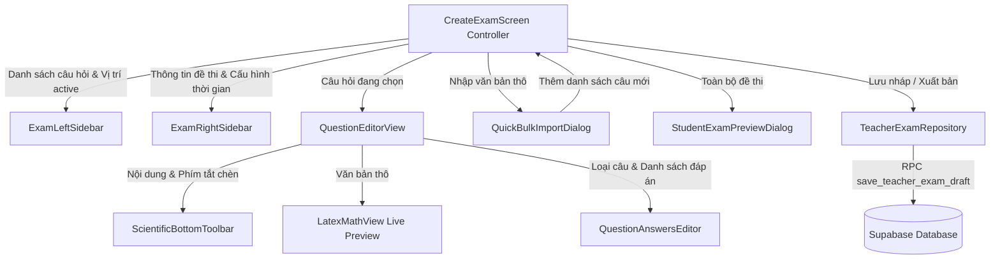

# Thiết kế Nâng cấp Màn hình Tạo đề thi Mới (Create Exam Screen Upgrade)

- **Ngày tạo**: 2026-10-01
- **Trạng thái**: Đã thống nhất (Approved via Brainstorming & Grill-me)
- **Tác giả**: AI Pair Programmer & Người dùng
- **Phạm vi áp dụng**: Ứng dụng `thi_nhanh` (Flutter Web & Mobile, Supabase PostgreSQL)

---

## 1. Tổng quan & Mục tiêu

Màn hình tạo đề thi hiện tại chỉ hỗ trợ dạng trắc nghiệm 4 đáp án đơn lẻ, không hỗ trợ công thức Toán/Lý/Hóa, thiếu các công cụ soạn thảo nâng cao và bố cục chưa tối ưu cho giáo viên biên soạn chuyên sâu.

### Mục tiêu nâng cấp:
1. **Bố cục giao diện 3 cột + 1 thanh công cụ Bottom Bar**:
   - **Left Sidebar**: Điều hướng danh sách câu hỏi, hỗ trợ kéo thả sắp xếp (Drag & drop reordering), phím tắt nhân bản/xóa câu.
   - **Center Workspace**: Khu vực soạn thảo chi tiết câu hỏi với khung Live Preview thời gian thực render công thức toán/lý/hóa chuẩn đẹp.
   - **Right Sidebar**: Bảng điều khiển tóm tắt thông số đề thi (số câu, môn học, tổng thời lượng, cấu hình thời gian làm bài chung hoặc thời gian riêng cho từng câu).
   - **Bottom Toolbar (Wolfram Alpha Style)**: Thanh công cụ nổi bật nằm cố định ở đáy khu vực trung tâm (giữa 2 sidebar), chia thành các tab danh mục (Toán, Vật lý, Hóa học, Ký hiệu Hy Lạp, Ngoại ngữ & Ký âm IPA). Khi click vào icon (ví dụ phân số $\frac{\square}{\square}$), hệ thống tự chèn template vào ô đang nhập liệu và bôi đen sẵn ô giữ chỗ `\square` để giáo viên điền số ngay.
2. **Đa dạng hóa 4 dạng câu hỏi**:
   - `single_choice`: Trắc nghiệm 1 đáp án đúng (Radio buttons).
   - `multiple_choice`: Trắc nghiệm nhiều đáp án đúng (Checkboxes).
   - `true_false`: Đúng / Sai (Nút chọn Đúng hoặc Sai trực quan).
   - `short_answer`: Điền đáp án ngắn / Con số / Cụm từ (Input field, so khớp tự động).
3. **Hỗ trợ Ký hiệu Khoa học & Đa ngôn ngữ**:
   - Render công thức Toán, Vật lý, Hóa học mượt mà qua Canvas native bằng `flutter_math_fork`.
   - Hỗ trợ công thức inline `$ ... $` và block `$$ ... $$`, chỉ số dưới hóa học ($H_2O, SO_4^{2-}$), mũi tên phản ứng ($\rightarrow, \rightleftharpoons$).
   - Tab ngoại ngữ hỗ trợ bảng ký âm quốc tế IPA (`/θ/, /ð/, /ʃ/, /æ/, /ə/...`) và các nguyên âm có dấu tiếng Pháp, Đức, Tây Ban Nha (`é, è, ê, ü, ö, ä, ß, ñ...`).
4. **Bộ tiện ích biên soạn nâng cao**:
   - Kéo thả đổi vị trí câu hỏi (`ReorderableListView`).
   - Nhân bản câu hỏi 1 chạm (Duplicate Question).
   - Nhập nhanh hàng loạt từ văn bản thô (Quick Bulk Import Modal) với bộ phân tích cú pháp tự động nhận diện câu hỏi, các đáp án và đáp án đúng.
   - Xem trước toàn diện đề thi ở góc nhìn học sinh (Interactive Student View Preview) kèm nút bật/tắt đáp án giải thích.
5. **Cơ sở dữ liệu & Tương thích ngược**:
   - Migration Supabase mới mở rộng bảng `questions` (`question_type`, `time_limit_seconds`, `image_url`), cập nhật index và các RPC `save_teacher_exam_draft`, `teacher_exam_draft`.
   - Giữ tương thích 100% với các đề thi đã tạo trước đây.

---

## 2. Kiến trúc & Phân rã Component

Áp dụng hướng tiếp cận **Kiến trúc Module hóa (Modular Architecture)**, tách biệt các khối chức năng vào thư mục `lib/screens/exam/widgets/`:

```
lib/screens/exam/
├── create_exam_screen.dart                 # Màn hình điều phối chính (State Controller & Scaffold)
└── widgets/
    ├── exam_left_sidebar.dart             # Sidebar trái: Danh sách câu, Drag & Drop, Nhân bản, Thêm câu
    ├── exam_right_sidebar.dart            # Sidebar phải: Tóm tắt đề, Môn học, Cài đặt thời gian chung/riêng
    ├── question_editor_view.dart          # Khu vực trung tâm: Soạn nội dung câu, điểm, giải thích, ảnh
    ├── question_answers_editor.dart       # Trình soạn đáp án thích ứng theo 4 dạng câu hỏi
    ├── scientific_bottom_toolbar.dart     # Bottom Bar công thức khoa học (Wolfram Alpha Style)
    ├── latex_math_view.dart               # Component render hỗn hợp Text + TeX LaTeX công thức
    ├── quick_bulk_import_dialog.dart      # Dialog dán văn bản nhận diện tự động hàng loạt câu hỏi
    └── student_exam_preview_dialog.dart   # Dialog xem trước đề thi thực tế của học sinh
```

### Biểu đồ Luồng dữ liệu (Data Flow)



---

## 3. Chi tiết Giao diện & Tương tác

### 3.1. Bố cục 3 Cột + 1 Bottom Bar

- **Top Navigation Bar**:
  - Tên đề thi, Badge trạng thái (Bản nháp / Đã xuất bản), Môn học.
  - Bộ nút chức năng bên phải:
    - `[Icons.visibility_outlined] Xem trước học sinh`
    - `[Icons.save_outlined] Lưu bản nháp`
    - `[Icons.rocket_launch_rounded] Lưu & Xuất bản` (Nút Primary nổi bật)
- **Left Sidebar (280px)**:
  - Header: Tiêu đề "DANH SÁCH CÂU HỎI", số lượng câu hiện có, nút "Nhập nhanh từ text".
  - Body: `ReorderableListView` chứa các card câu hỏi:
    - Icon nắm kéo (`Icons.drag_indicator`)
    - Thứ tự câu (Câu 1, Câu 2...)
    - Badge loại câu (`1 Đ/án`, `Nhiều Đ/án`, `Đúng/Sai`, `Điền số`)
    - Điểm số và thời gian làm bài riêng (nếu có)
    - Nút ba chấm menu / icon nhân bản nhanh và xóa câu.
  - Footer: Nút lớn `+ Thêm câu hỏi mới`.
- **Right Sidebar (260px)**:
  - Header: "TỔNG QUAN ĐỀ THI".
  - Nội dung tóm tắt: Tên đề, Môn học, Tổng số câu hỏi, Tổng điểm dự kiến.
  - Thiết lập thời gian làm bài:
    - Lựa chọn 1: Thời gian chung toàn đề (Ví dụ: 45 phút).
    - Lựa chọn 2 (Switch Toggle): "Bật thời gian riêng cho từng câu hỏi". Khi bật, mỗi câu hỏi trong khu vực soạn thảo sẽ hiện ô cài đặt số giây đếm ngược riêng (ví dụ 60s/câu).
  - Cài đặt điểm mặc định cho mỗi câu mới thêm (Mặc định 1 điểm).
- **Center Workspace (Expanded)**:
  - Khối thông tin đầu câu: `CÂU X` + Dropdown chọn loại câu hỏi (`QuestionTypeSelector`) + Điểm số + Nút nhân bản + Nút xóa.
  - Ô soạn đề bài (`TextFormField` nhiều dòng, font chữ chuẩn, tự co giãn).
  - **Khung Live Preview Card**: Nằm ngay dưới ô đề bài, tự động render Text + LaTeX theo thời gian thực với viền bo tròn nhẹ, badge "Xem trước thời gian thực".
  - Đính kèm ảnh minh họa: Cho phép tải ảnh từ URL hoặc thiết bị (Image Picker).
  - **Khu vực soạn đáp án thích ứng (`QuestionAnswersEditor`)**:
    - **Single Choice**: Danh sách A, B, C, D... kèm nút Radio tròn chọn đáp án đúng. Cho phép thêm đến 8 lựa chọn, nút xóa từng lựa chọn.
    - **Multiple Choice**: Danh sách A, B, C, D... kèm Checkbox vuông, cho phép chọn đồng thời nhiều đáp án đúng.
    - **True / False**: Hiển thị 2 nút bấm to dạng Segmented Button: `[ Đúng ]` - `[ Sai ]`. Giáo viên chỉ cần click chọn 1 trong 2 để đặt đáp án đúng.
    - **Short Answer**: Ô nhập "Đáp án chuẩn xác", và nút "+ Thêm đáp án tương đương được chấp nhận" (hữu ích cho môn Toán/Hóa, ví dụ nhận cả `0.5` hoặc `1/2`).
  - Ô soạn lời giải thích chi tiết (`Explanation`): Hiển thị khi học sinh xem lại bài thi sau khi nộp.
- **Bottom Toolbar (Scientific & Languages Keyboard)**:
  - Vị trí: Dock cố định phía dưới khu vực soạn thảo, nằm giữa Sidebar trái và Sidebar phải.
  - Tab Bar phía trên toolbar:
    - `[Toán học]`
    - `[Vật lý]`
    - `[Hóa học]`
    - `[Ký hiệu Hy Lạp]`
    - `[Ngoại ngữ & IPA]`
  - Dải phím component tương ứng từng tab:
    - Khi chọn `Toán học`:
      - Nút Phân số: Icon hình $\frac{\square}{\square} \to$ chèn `\frac{\square}{\square}`
      - Căn bậc hai: $\sqrt{\square} \to$ chèn `\sqrt{\square}`
      - Căn bậc $n$: $\sqrt[n]{\square} \to$ chèn `\sqrt[\square]{\square}`
      - Số mũ: $x^\square \to$ chèn `^{\square}`
      - Chỉ số dưới: $x_\square \to$ chèn `_{\square}`
      - Tích phân: $\int \to$ chèn `\int_{\square}^{\square} \square \, dx`
      - Đạo hàm: $\frac{d}{dx} \to$ chèn `\frac{d}{dx}(\square)`
      - Giới hạn: $\lim \to$ chèn `\lim_{x \to \square} \square`
      - Tổng xích-ma: $\sum \to$ chèn `\sum_{i=1}^{\square} \square`
      - Ký hiệu: $\pm, \times, \div, \neq, \leq, \geq, \approx, \infty, \in, \notin, \subset, \cup, \cap, \vec{v}$
    - Khi chọn `Vật lý`:
      - $\vec{F}, \vec{v}, \vec{a}, \Delta t, \lambda, \omega, \Omega, \mu\text{m}, \text{m/s}^2, \text{kWh}, \text{rad/s}$
    - Khi chọn `Hóa học`:
      - $\rightarrow, \rightleftharpoons, \uparrow, \downarrow, \xrightarrow{t^\circ}, \text{H}_2\text{O}, \text{CO}_2, \text{SO}_4^{2-}, \text{Fe}^{3+}, \text{OH}^-$
    - Khi chọn `Ký hiệu Hy Lạp`:
      - $\alpha, \beta, \gamma, \delta, \epsilon, \theta, \lambda, \mu, \pi, \rho, \sigma, \tau, \phi, \omega, \Delta, \Omega$
    - Khi chọn `Ngoại ngữ & IPA`:
      - Bảng ký âm IPA tiếng Anh: `/θ/, /ð/, /ʃ/, /ʒ/, /tʃ/, /dʒ/, /ŋ/, /æ/, /ʌ/, /ə/, /ɜː/, /ɪ/, /iː/, /ʊ/, /uː/, /eɪ/, /aɪ/, /ɔɪ/, /aʊ/, /əʊ/`
      - Ký tự có dấu châu Âu: `é, è, ê, ë, à, â, ç, ü, ö, ä, ß, ñ, ¡, ¿`
  - **Trải nghiệm gõ thông minh**: Tự động chèn vào vị trí con trỏ trong trường nhập liệu đang focus (`TextEditingController`). Tự động chọn (highlight) ký tự giữ chỗ `\square` để người dùng gõ số đè lên mà không cần xóa tay.

---

## 4. Mô hình Dữ liệu (Data Model)

### 4.1. Enum `QuestionType`
```dart
enum QuestionType {
  singleChoice('single_choice', '1 đáp án đúng', Icons.radio_button_checked),
  multipleChoice('multiple_choice', 'Nhiều đáp án đúng', Icons.check_box_outlined),
  trueFalse('true_false', 'Đúng / Sai', Icons.flaky_outlined),
  shortAnswer('short_answer', 'Điền đáp án ngắn', Icons.edit_note_outlined);

  final String value;
  final String label;
  final IconData icon;
  const QuestionType(this.value, this.label, this.icon);

  static QuestionType fromString(String? val) {
    return QuestionType.values.firstWhere(
      (e) => e.value == val,
      orElse: () => QuestionType.singleChoice,
    );
  }
}
```

### 4.2. Class `QuestionDraft`
```dart
class QuestionDraft {
  QuestionDraft({
    required this.id,
    this.type = QuestionType.singleChoice,
    this.body = '',
    List<String>? answers,
    List<int>? correctAnswers,
    this.points = '1',
    this.timeLimitSeconds,
    this.explanation = '',
    this.imageUrl,
  })  : answers = answers ?? List.filled(4, ''),
        correctAnswers = correctAnswers ?? [0];

  final String id;
  QuestionType type;
  String body;
  List<String> answers;
  List<int> correctAnswers;
  String points;
  int? timeLimitSeconds;
  String explanation;
  String? imageUrl;

  QuestionDraft copyWith({
    String? id,
    QuestionType? type,
    String? body,
    List<String>? answers,
    List<int>? correctAnswers,
    String? points,
    int? timeLimitSeconds,
    String? explanation,
    String? imageUrl,
  }) {
    return QuestionDraft(
      id: id ?? this.id,
      type: type ?? this.type,
      body: body ?? this.body,
      answers: answers != null ? List.from(answers) : List.from(this.answers),
      correctAnswers: correctAnswers != null ? List.from(correctAnswers) : List.from(this.correctAnswers),
      points: points ?? this.points,
      timeLimitSeconds: timeLimitSeconds ?? this.timeLimitSeconds,
      explanation: explanation ?? this.explanation,
      imageUrl: imageUrl ?? this.imageUrl,
    );
  }

  factory QuestionDraft.fromJson(Map<String, dynamic> json) {
    final typeStr = json['type'] as String? ?? json['question_type'] as String? ?? 'single_choice';
    final type = QuestionType.fromString(typeStr);

    List<String> answers = [];
    if (json['answers'] is List) {
      answers = (json['answers'] as List).map((e) => e.toString()).toList();
    } else {
      answers = List.filled(4, '');
    }

    List<int> correctAnswers = [];
    if (json['correctAnswers'] is List) {
      correctAnswers = (json['correctAnswers'] as List).map((e) => (e as num).toInt()).toList();
    } else if (json['correctAnswer'] != null) {
      correctAnswers = [(json['correctAnswer'] as num).toInt()];
    } else {
      correctAnswers = [0];
    }

    return QuestionDraft(
      id: json['id']?.toString() ?? DateTime.now().microsecondsSinceEpoch.toString(),
      type: type,
      body: json['body'] as String? ?? '',
      answers: answers,
      correctAnswers: correctAnswers,
      points: '${json['points'] ?? 1}',
      timeLimitSeconds: (json['timeLimitSeconds'] as num?)?.toInt(),
      explanation: json['explanation'] as String? ?? '',
      imageUrl: json['imageUrl'] as String?,
    );
  }

  Map<String, dynamic> toJson() => {
    'id': id,
    'type': type.value,
    'body': body,
    'answers': answers,
    'correctAnswers': correctAnswers,
    'correctAnswer': correctAnswers.isNotEmpty ? correctAnswers.first : 0,
    'points': points,
    'timeLimitSeconds': timeLimitSeconds,
    'explanation': explanation,
    'imageUrl': imageUrl,
  };
}
```

---

## 5. Cửa sổ Nhập nhanh từ Văn bản (Quick Bulk Import Dialog)

### 5.1. Định dạng văn bản hỗ trợ
Giáo viên có thể dán văn bản từ Word hoặc tài liệu theo chuẩn:
```
Câu 1: Cho hàm số $f(x) = \frac{x^2 - 1}{x + 1}$. Giá trị của $f(3)$ là:
*A. 2
B. 4
C. 6
D. 8
Lời giải: Rút gọn $f(x) = x - 1$, khi đó $f(3) = 2$.

Câu 2: Những chất nào sau đây là oxit axit?
*A. $CO_2$
B. $CaO$
*C. $SO_3$
D. $Na_2O$

Câu 3: Nước sôi ở 100 độ C ở áp suất tiêu chuẩn.
*A. Đúng
B. Sai
```

### 5.2. Thuật toán phân tích cú pháp
1. Tách các khối câu bằng Regex nhận dạng `^(Câu|Bài|\d+)[\s\.:\d]+`.
2. Trong mỗi khối câu:
   - Dòng đầu tiên đến trước các lựa chọn A, B, C... là nội dung đề bài (Body).
   - Tách các lựa chọn bằng Regex `^(\*?\s*[A-H][\.\)])\s*(.*)`.
   - Nếu có dấu `*` trước phương án $\to$ thêm chỉ số vào `correctAnswers`.
   - Tự động nhận diện loại câu: Nếu có 2 lựa chọn "Đúng/Sai" $\to$ chuyển thành `true_false`; nếu có nhiều phương án có dấu `*` $\to$ chuyển thành `multiple_choice`; còn lại mặc định là `single_choice`.
   - Dòng bắt đầu bằng `Lời giải:` hoặc `Giải thích:` $\to$ lưu vào `explanation`.
3. Khung xem trước trong Dialog hiển thị số câu đã nhận diện, cho phép giáo viên kiểm tra nhanh và bấm nút "Thêm vào đề thi".

---

## 6. Cơ sở Dữ liệu & Di chuyển Dữ liệu (Supabase Migration)

Tạo file migration: `supabase/migrations/202610010001_rich_exam_questions_and_types.sql`:

1. **Thêm cột vào bảng `public.questions`**:
   - `question_type text not null default 'single_choice'`
   - `time_limit_seconds integer check (time_limit_seconds is null or time_limit_seconds > 0)`
   - `image_url text`
2. **Gỡ bỏ index unique chỉ cho phép 1 đáp án đúng**:
   - `drop index if exists public.question_options_one_correct_answer;`
3. **Nâng cấp hàm `public.save_teacher_exam_draft`**:
   - Đọc trường `type`, `timeLimitSeconds`, `imageUrl`, `explanation`.
   - Hỗ trợ lưu nhiều đáp án có `is_correct = true` trong mảng `answers` thông qua `correctAnswers`.
4. **Nâng cấp hàm `public.teacher_exam_draft`**:
   - Trả về JSON chứa đầy đủ `type`, `timeLimitSeconds`, `explanation`, `imageUrl`, và mảng `correctAnswers`.

---

## 7. Xử lý Lỗi & Trường hợp Biên (Edge Cases & Resilience)

1. **Công thức LaTeX gõ dở hoặc lỗi cú pháp**:
   - Khi giáo viên gõ cú pháp chưa hợp lệ (ví dụ `\frac{a}{`), `LatexMathView` tự động bắt ngoại lệ và hiển thị chuỗi ký tự thô an toàn, không làm gián đoạn việc gõ phím hoặc gây crash giao diện.
2. **Chuyển đổi loại câu hỏi liên tục**:
   - Khi đổi từ `single_choice` sang `multiple_choice` và ngược lại, nội dung text của các phương án được giữ nguyên vẹn 100%.
   - Khi đổi sang `true_false`, tự động điền 2 phương án ["Đúng", "Sai"].
3. **Mất kết nối mạng khi đang soạn đề**:
   - Sử dụng cơ chế Auto-save nháp cục bộ vào `SharedPreferences` theo chu kỳ 30 giây để giáo viên không bị mất dữ liệu nếu lỡ tay tải lại trang web hoặc mất mạng đột ngột.
4. **Kiểm tra tính hợp lệ trước khi Xuất bản (Publish Validation)**:
   - Thông báo rõ ràng vị trí câu bị lỗi (Ví dụ: "Câu 3 chưa có đáp án đúng nào được chọn", "Câu 5 nội dung đề bài bị để trống") và tự động cuộn đến câu hỏi đó để giáo viên sửa chữa ngay.

---

## 8. Kế hoạch Kiểm thử (Testing Strategy)

1. **Unit Tests**:
   - `test/models/question_draft_test.dart`: Kiểm thử chuyển đổi JSON 2 chiều, clone copyWith, xử lý fallback tương thích cũ.
   - `test/utils/bulk_import_parser_test.dart`: Kiểm thử phân tích cú pháp dán văn bản (nhận diện đúng các loại câu single, multi, true/false, bảo toàn mã LaTeX).
2. **Widget Tests**:
   - `test/screens/exam/widgets/latex_math_view_test.dart`: Kiểm tra hiển thị văn bản thường và công thức `$x^2$`.
   - `test/screens/exam/widgets/scientific_bottom_toolbar_test.dart`: Kiểm tra click vào icon phân số chèn đúng mẫu vào trường văn bản đang focus.
   - `test/screens/exam/create_exam_screen_test.dart`: Kiểm tra chuyển tab câu hỏi, thêm câu, nhân bản câu, kéo thả sắp xếp danh sách câu.
3. **Integration / E2E Verification**:
   - Tạo đề thi có công thức toán/lý/hóa, lưu nháp vào Supabase, tải lại kiểm tra dữ liệu toàn vẹn.
   - Xem thử đề thi qua `StudentExamPreviewDialog`.

---

## 9. Quy tắc Triển khai & Tự động Đẩy mã (Auto-Push Rule)

Theo quy định bắt buộc trong `.agents/AGENTS.md`:
- Sau khi hoàn thành triển khai mã nguồn và vượt qua toàn bộ kiểm thử xác minh, tiến hành commit và chạy `git push` lên kho lưu trữ GitHub để kích hoạt pipeline tự động cập nhật qua GitHub Actions.
