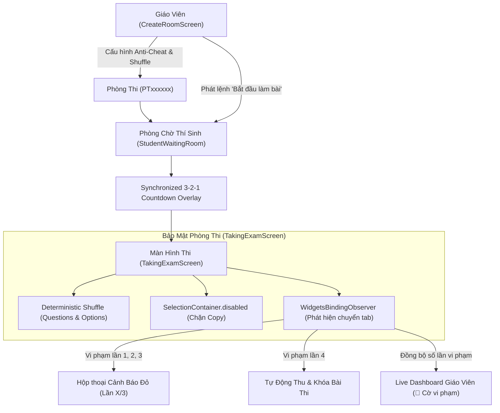

# Thiết Kế Chi Tiết: Nâng Cao Trải Nghiệm Phòng Thi (Chống Gian Lận Đa Tầng, Xáo Trộn Đề & Đếm Ngược Đồng Bộ)

> **Mã thiết kế:** `SPEC-ROOM-ENHANCE-001`  
> **Ngày phê duyệt:** 04/10/2026  
> **Trạng thái:** Approved by User  
> **Tác giả:** Antigravity AI & System Architect  

---

## 1. TỔNG QUAN & MỤC TIÊU HỆ THỐNG

### 1.1. Bối cảnh
Tính năng phòng thi trực tiếp (`/room`) của Thi Nhanh hiện đã hỗ trợ đầy đủ luồng: Tạo phòng $\rightarrow$ Phòng chờ $\rightarrow$ Thi trực tiếp $\rightarrow$ Live Dashboard $\rightarrow$ Xếp hạng. Tuy nhiên, để đảm bảo tính **công bằng tuyệt đối**, **bảo mật học thuật** và mang lại **trải nghiệm kịch tính, hứng khởi**, hệ thống cần được nâng cấp với 3 trụ cột chính:
1. **Chống gian lận đa tầng (Anti-Cheating Multi-Layer):**
   - Xáo trộn câu hỏi và các phương án trả lời độc lập cho từng thí sinh.
   - Phát hiện chuyển tab hoặc rời ứng dụng (tối đa 3 lần nhắc nhở, lần thứ 4 tự động thu bài).
   - Vô hiệu hóa bôi đen và sao chép văn bản câu hỏi thi.
2. **Giám sát thời gian thực cho Giáo viên:**
   - Hiển thị trực tiếp cờ đỏ vi phạm 🚩 kèm số lần rời màn hình của từng học sinh trên Live Dashboard.
3. **Khởi động đồng bộ kịch tính (3-2-1 Countdown Animation):**
   - Đếm ngược 3... 2... 1... "BẮT ĐẦU!" toàn màn hình ngay khi giáo viên phát lệnh mở bài thi.

---

## 2. KIẾN TRÚC & CÁC THÀNH PHẦN CHI TIẾT



---

## 3. ĐẶC TẢ CHI TIẾT TỪNG TÍNH NĂNG

### 3.1. Cấu hình tại màn hình Tạo phòng thi ([`CreateRoomScreen`](file:///c:/Users/ADMINE/Desktop/CODE/thi_nhanh/lib/screens/room/create_room_screen.dart))
- Thêm nhóm tùy chọn **"Cài đặt bảo mật & phòng thi"** với giao diện Material 3 sang trọng:
  - Công tắc `[x] Xáo trộn câu hỏi & đáp án`: Tự động đảo ngẫu nhiên vị trí câu hỏi và các lựa chọn A, B, C, D cho từng thí sinh (Mặc định: **BẬT**).
  - Công tắc `[x] Giám sát chống gian lận`: Phát hiện học sinh chuyển tab/rời app, cảnh báo tối đa 3 lần và tự thu bài ở lần thứ 4 (Mặc định: **BẬT**).
- Các cài đặt này được truyền qua thông tin phòng thi (room metadata/options) và chuyển tiếp tới luồng làm bài của thí sinh.

---

### 3.2. Đếm ngược khởi động đồng bộ 3-2-1 ([`StudentWaitingRoomScreen`](file:///c:/Users/ADMINE/Desktop/CODE/thi_nhanh/lib/screens/room/student_waiting_room_screen.dart))
- **Kích hoạt:** Khi thí sinh đang ở phòng chờ và nhận tín hiệu Supabase Realtime channel `room:$roomId` thông báo phòng chuyển sang trạng thái `live`:
  - Thay vì chuyển trang lập tức, hiển thị `CountdownOverlayWidget` nổi trên toàn màn hình.
  - Hiệu ứng đếm ngược: `3` $\rightarrow$ `2` $\rightarrow$ `1` $\rightarrow$ `BẮT ĐẦU!` với hiệu ứng phóng to (Scale Transition) và nhịp đập (Pulse Animation), mỗi nhịp 1000ms.
  - Khi đếm ngược chạm 0, tự động điều hướng sang `/taking_exam`.

---

### 3.3. Xáo trộn ngẫu nhiên tất định (Deterministic Shuffling) ([`TakingExamScreen`](file:///c:/Users/ADMINE/Desktop/CODE/thi_nhanh/lib/screens/exam/taking_exam_screen.dart))
- **Nguyên lý hoạt động:**
  - Nhằm đảm bảo tính công bằng và ổn định: Nếu thí sinh bị mất kết nối hoặc F5 tải lại trang, thứ tự câu hỏi và thứ tự đáp án của thí sinh đó **phải giữ nguyên vẹn**, không bị đảo lại lần hai làm mất phương hướng.
  - Sử dụng hàm sinh số giả ngẫu nhiên có `seed` cố định tạo từ định danh của thí sinh và bài thi:
    ```dart
    final seed = (attemptId ?? '${userId}_$roomId').hashCode;
    final random = Random(seed);
    // Shuffle câu hỏi
    questions.shuffle(random);
    // Shuffle phương án đáp án trong từng câu hỏi
    for (var q in questions) {
      final optSeed = (q['id'].toString() + seed.toString()).hashCode;
      options.shuffle(Random(optSeed));
    }
    ```
- **Bảo toàn chấm điểm:** Đáp án thí sinh chọn luôn được đối chiếu theo `option['id']` duy nhất trong cơ sở dữ liệu. Dù đáp án đúng ở vị trí A hay D thì việc tính điểm tự động vẫn chính xác 100%.

---

### 3.4. Phát hiện chuyển tab & Giới hạn vi phạm ([`TakingExamScreen`](file:///c:/Users/ADMINE/Desktop/CODE/thi_nhanh/lib/screens/exam/taking_exam_screen.dart))
- **Cơ chế bắt sự kiện:**
  - `WidgetsBindingObserver` theo dõi trạng thái `didChangeAppLifecycleState`:
    - `AppLifecycleState.paused` (chuyển sang ứng dụng khác trên Mobile/Tablet).
    - `AppLifecycleState.inactive` hoặc `AppLifecycleState.hidden` (chuyển tab trên Browser Web, thu nhỏ cửa sổ).
- **Quy tắc xử phạt 4 cấp độ:**
  - **Lần 1:** Hiện hộp thoại cảnh báo:  
    `⚠️ CẢNH BÁO VI PHẠM (Lần 1/3): Bạn vừa rời khỏi màn hình bài thi. Vui lòng tập trung làm bài! Vi phạm quá 3 lần bài thi sẽ tự động thu.`
  - **Lần 2:** Cảnh báo cấp độ 2:  
    `⚠️ CẢNH BÁO VI PHẠM (Lần 2/3): Hệ thống đã ghi nhận 2 lần chuyển màn hình. Bạn chỉ còn 1 lần nhắc nhở cuối cùng!`
  - **Lần 3:** Cảnh báo khẩn cấp:  
    `🚨 CẢNH BÁO CUỐI CÙNG (Lần 3/3): Bạn đã vi phạm 3 lần. Nếu rời màn hình thêm 1 lần nữa, bài thi sẽ bị TỰ ĐỘNG THU BÀI NGAY LẬP TỨC!`
  - **Lần 4 (Cưỡng chế nộp bài):**  
    Khóa toàn bộ tương tác trên màn hình, hiển thị thông báo:  
    `⛔ BÀI THI BỊ KHÓA: Bạn đã vi phạm chuyển tab quá 3 lần quy định. Hệ thống đang tiến hành nộp bài tự động...`  
    Gọi ngay hàm `_submitExam()` và chuyển hướng về màn hình kết quả `/result`.
- **Cơ chế chống cảnh báo giả (False Positive Guard):**
  - Không tính vi phạm nếu bài thi đã nộp (`_hasSubmitted == true`).
  - Không tính vi phạm chồng lấn khi hộp thoại cảnh báo vi phạm đang được mở trên màn hình.

---

### 3.5. Chặn bôi đen & Sao chép nội dung câu hỏi
- Bọc toàn bộ khu vực hiển thị nội dung câu hỏi và các đáp án trong `SelectionContainer.disabled(child: ...)`.
- Vô hiệu hóa menu ngữ cảnh chuột phải và phím tắt copy (Ctrl+C / Cmd+C) trên trình duyệt Web, ngăn chặn hoàn toàn việc sao chép đề bài gửi sang các công cụ giải bài bên ngoài.

---

### 3.6. Hiển thị giám sát trên Live Dashboard ([`LiveDashboardScreen`](file:///c:/Users/ADMINE/Desktop/CODE/thi_nhanh/lib/screens/exam/live_dashboard_screen.dart))
- Trên danh sách thí sinh của Bảng theo dõi trực tiếp:
  - Nếu học sinh có vi phạm chuyển tab $\ge 1$: Hiển thị chip cảnh báo đỏ nổi bật:  
    `🚩 X vi phạm` (ví dụ: `🚩 2 vi phạm`).
  - Nếu học sinh bị khóa do đủ 4 lần vi phạm: Hiển thị huy hiệu `⛔ Bị thu bài (Vi phạm quy chế)`.

---

## 4. CHIẾN LƯỢC KIỂM THỬ (TESTING & VERIFICATION)

Hệ thống sẽ được xây dựng theo chuẩn **Test-Driven Development (TDD)** với bộ bài kiểm thử tự động toàn diện:
1. `test/utils/exam_shuffle_helper_test.dart`:
   - Kiểm tra tính hoán vị ngẫu nhiên nhưng tất định theo seed (cùng seed $\rightarrow$ cùng thứ tự; khác seed $\rightarrow$ thứ tự khác nhau).
   - Kiểm tra tính chính xác của việc tính điểm sau khi xáo trộn.
2. `test/widgets/countdown_overlay_test.dart`:
   - Kiểm tra hiển thị đủ các bước 3, 2, 1 và gọi callback hoàn thành.
3. `test/screens/taking_exam_anti_cheat_test.dart`:
   - Giả lập sự kiện `AppLifecycleState.paused / inactive`.
   - Kiểm tra hiển thị dialog cảnh báo lần 1, 2, 3.
   - Kiểm tra lần 4 tự động kích hoạt nộp bài.
   - Kiểm tra không bị lỗi `RenderFlex overflow` trên màn hình di động (360x640).
4. `test/screens/live_dashboard_violations_test.dart`:
   - Kiểm tra hiển thị cờ đỏ vi phạm trên bảng theo dõi của giáo viên.
