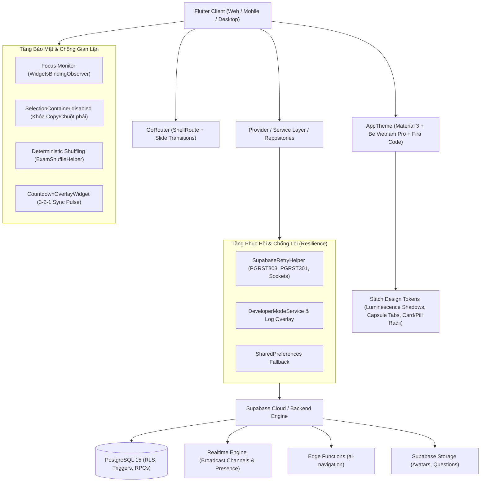

# BÁO CÁO ĐÁNH GIÁ TỔNG QUAN & CHI TIẾT TOÀN DIỆN HỆ THỐNG THI NHANH (ONTHI_COMMUNITY)

> **Ngày thực hiện:** 09/10/2026 *(Cập nhật sau khi hoàn thành Tính Năng Lưu Đề Về Kho Cá Nhân, Mở Phòng Thi Từ Đề Cộng Đồng & Xem Trước Toàn Bộ Câu Hỏi Kèm Quick-Jump Navigator)*  
> **Phiên bản mã nguồn:** 1.0.0+1  
> **Trạng thái kiểm thử:** **192 / 192 bài kiểm thử tự động (Unit, Widget, E2E) đạt 100% PASS**  
> **Phạm vi đánh giá:** Toàn bộ mã nguồn `lib/`, `supabase/`, `test/`, `assets/`, tài liệu thiết kế & kế hoạch (`docs/superpowers/`), tài liệu kiến trúc, hệ thống chống gian lận và quy trình kiểm thử tự động.

---

## 1. TỔNG QUAN KIẾN TRÚC & CÔNG NGHỆ (SYSTEM ARCHITECTURE)

### 1.1. Công nghệ Cốt lõi
- **Framework Client:** Flutter (SDK ^3.10.0), Dart 3.x. Hỗ trợ đa nền tảng (Web, Windows, Android, iOS).
- **Backend & Database:** Supabase (PostgreSQL 15+), PostgREST RESTful API, Realtime Engine (WebSockets), Auth & Storage.
- **Quản lý Trạng thái:** Kết hợp `Provider` (`AuthProvider`), Service Pattern (`ProfileService`, `DeveloperModeService`, `AiNavigationService`) và Repository Pattern (`AssessmentRepository`, `TeacherExamRepository`, `RoomRepository`).
- **Điều hướng Tuyến đường:** `GoRouter` 17.3.0 với kiến trúc lồng ghép `ShellRoute` (chứa `TopNavBar` cố định cho các trang chính) kết hợp bộ chuyển cảnh `buildPageWithSlideTransition`.
- **Hệ Thống Thiết Kế & Tokens Stitch Modern (`AppTheme`):**
  - **Bảng màu:** Primary Violet (`#6557E8`), Primary Dark Indigo (`#1E1B4B`), Lavender Surface Tint (`#F7F5FE`), Text Main (`#1E293B`).
  - **Typography kép:** Font hiển thị và văn bản Google Fonts `Be Vietnam Pro` kết hợp Google Fonts `Fira Code` cho đồng hồ đếm ngược, mã phòng thi PIN, điểm số thang 10 và các chỉ số kỹ thuật.
  - **Đổ bóng quang học (Luminescence Shadows):** `luminescenceShadow` với ánh tím đa tầng mềm mại kết hợp `cardShadow` tiêu chuẩn cho các thẻ nổi.
  - **Hệ thống Bo góc chuẩn hóa:** `cardRadius` (16px), `pillRadius` (100px capsule), `inputRadius` (12px).
- **Công thức Toán & Đồ họa:** `flutter_math_fork` cho LaTeX, bộ biên dịch trực quan độc quyền `VisualMathCompiler` + `VisualMathBlock`, mã QR động `qr_flutter`.
- **Cơ chế Chống Gian Lận Đa Tầng (Anti-Cheat Engine):**
  - Giám sát trạng thái ứng dụng vòng đời thực (`WidgetsBindingObserver`), phát hiện rời app, chuyển tab hoặc thu nhỏ cửa sổ.
  - Xáo trộn câu hỏi và đáp án tất định theo seed ngẫu nhiên (`ExamShuffleHelper`).
  - Khóa sao chép văn bản câu hỏi và chặn bôi đen đề bài (`SelectionContainer.disabled`).
  - Đếm ngược toàn màn hình 3-2-1 đồng bộ (`CountdownOverlayWidget`).

---

## 2. BẢN ĐỒ KHU VỰC, TÍNH NĂNG & MÀN HÌNH (SCREENS & FEATURES)

### 2.1. Phân Hệ Xác Thực & Chào Đón (Auth & Onboarding)
1. **Màn hình Chào & Đăng nhập ([`GreetingScreen`](file:///c:/Users/ADMINE/Desktop/CODE/thi_nhanh/lib/screens/auth/greeting_screen.dart)):**
   - Đồ họa minh họa banner sách phát sáng (`glowing_book.png`, `clean_login_bg.png`).
   - Hỗ trợ đăng nhập Email/Mật khẩu, đăng ký tài khoản mới qua mã OTP gửi về Email, và chế độ **"Khách tham gia nhanh" (Guest Mode)** không cần đăng nhập.
2. **Khôi phục mật khẩu ([`ResetPasswordScreen`](file:///c:/Users/ADMINE/Desktop/CODE/thi_nhanh/lib/screens/auth/reset_password_screen.dart)):**
   - Luồng xác minh mã OTP gửi về Email bằng `EmailVerifier` và `OtpMailer` an toàn.

### 2.2. Phân Hệ Học Sinh (Student Experience) — *Được Hiện Đại Hóa Giao Diện Stitch*
1. **Thanh Điều Hướng Cố Định ([`TopNavBar`](file:///c:/Users/ADMINE/Desktop/CODE/thi_nhanh/lib/shared/widgets/top_nav_bar.dart)):**
   - Giữ nguyên tuyệt đối 100% 4 phân hệ cốt lõi: `Home` (`/home`), `Tìm kiếm` (`/search`), `Quản lí đề` (`/teacher_exams`), `Tạo phòng thi` (`/create_room`).
   - Tab con nhộng active pill hiện đại hóa (`surfaceLavender` + viền violet nhẹ + `pillRadius`), biểu tượng squircle gradient với hiệu ứng phát sáng nhẹ, thanh nhập mã PIN phòng thi nhanh phong cách Fira Code và vòng nhẫn avatar người dùng tím thanh lịch.
2. **Trang chủ ([`HomeScreen`](file:///c:/Users/ADMINE/Desktop/CODE/thi_nhanh/lib/screens/home/home_screen.dart)):**
   - **Hero Banner Gradient Tím Sâu (Stitch Hero Banner):** Nền gradient tím cao cấp (`#6557E8` $\rightarrow$ `#4C3BCE` $\rightarrow$ `#3828A8`), bo góc 24px với bóng luminescence 24px. Bên trái là Avatar viền sáng, lời chào cá nhân hóa và huy hiệu con nhộng "Tài khoản Toàn quyền".
   - **Thanh Chuyển Đổi Không Gian Làm Việc Con Nhộng Kính Mờ (Embedded Workspace Capsule Switcher):** Được tích hợp tinh gọn trực tiếp bên trong Hero Banner với nền kính mờ (`rgba(255,255,255,0.15)`), tab active nền trắng chữ tím nổi bật, cho phép chuyển đổi tức thì giữa `🎓 Học tập & Thi thử` và `📝 Soạn đề & Quản lý`.
   - **Lưới Điều Hướng Thông Minh 2 Thẻ (Stitch Smart Navigation Grid):**
     - *Thẻ 1 — Tiến Độ Học Tập / Bài Thi Dở Dang:* Thẻ bo góc 22px, hiển thị trạng thái bài làm chưa nộp gần nhất từ `ProfileService.fetchActiveAttempt()`, nhãn cảnh báo vàng amber, hiệu ứng nhịp tim `ScaleTransition` và nút "Tiếp tục làm bài" / "Khám phá đề thi".
     - *Thẻ 2 — Phòng Thi Trực Tiếp & Vào Nhanh:* Thẻ bo góc 22px, hiển thị phòng thi đang mở từ `ProfileService.fetchActiveLiveRoom()`, chỉ báo xanh lục nhấp nháy realtime và tích hợp trực tiếp ô nhập mã PIN phòng thi chuẩn Fira Code (`Nhập mã phòng PTxxxxxx...`) kèm nút "Vào ngay".
   - **Hàng 8 Chips Môn Học Trực Quan (`📚 Danh Mục Môn Học`):** Tích hợp 8 môn học phổ thông (Toán, Vật lý, Hóa học, Tiếng Anh, Sinh học, Lịch sử, Địa lý, Ngữ văn) dạng thẻ pill bo tròn với icon đặc trưng, click vào chuyển hướng trực tiếp sang `/search?subject=...`.
   - **Thanh Chỉ Số Nhanh (Quick Stats Bar):** Đồng bộ dữ liệu thực tế Supabase (`_studentStats`, `_teacherStats`).
   - Danh sách đề thi nổi bật và đề thi mới nhất được nâng cấp với `cardRadius` (16px) và `cardShadow` đa tầng mềm mại.
3. **Tìm kiếm & Bộ lọc ([`SearchScreen`](file:///c:/Users/ADMINE/Desktop/CODE/thi_nhanh/lib/screens/home/search_screen.dart)):**
   - Thẻ kết quả thi dạng Card hiện đại hóa, chip chọn môn và bộ lọc cấp độ dạng con nhộng mềm mại.
   - **Nút Lưu Nhanh 1-Chạm (One-Touch Bookmark Save):** Tích hợp nút icon bookmark ngay trên mỗi thẻ kết quả thi, hiển thị trực quan trạng thái đã lưu/chưa lưu (`Icons.bookmark_rounded` vs `Icons.bookmark_border_rounded`), thông báo SnackBar tức thì và đồng bộ với kho đề thi cá nhân.
   - Định dạng thời gian tương đối động (`formatRelativeTime`).
4. **Chi tiết đề thi ([`ExamDetailScreen`](file:///c:/Users/ADMINE/Desktop/CODE/thi_nhanh/lib/screens/exam/exam_detail_screen.dart)):**
   - Thẻ tóm tắt thông tin đề bài và bảng thao tác hành động bổ sung `luminescenceShadow` phát sáng ánh tím nhẹ nhàng.
   - **Nút Lưu Đề Vào Kho Cá Nhân:** Bổ sung tùy chọn "Lưu đề" / "Bỏ lưu đề" tiện lợi bên cạnh các nút "Bắt đầu tự luyện" và "Lưu vào yêu thích".
   - **Chỉ Báo Cuộn Mũi Tên Nảy (Scroll Down Indicator):** Biểu tượng mũi tên nảy hoạt hình tinh tế kèm chú thích "Xem chi tiết câu hỏi & đáp án", click vào cuộn mượt xuống vùng nội dung câu hỏi.
   - **Khu Vực Xem Trước Toàn Bộ Đề Thi (Full Question Preview):** Hiển thị danh sách đầy đủ các câu hỏi, các phương án A/B/C/D với đáp án đúng được highlight viền & nền xanh lá cây, khung lời giải chi tiết, công tắc Toggle "Hiện đáp án & giải thích".
   - **Bảng Con Quick-Jump Navigator (Lưới Phím Tắt Câu Hỏi):** Sidebar sticky hiển thị lưới số 1..N, bấm vào số câu sẽ tự động cuộn mượt đưa câu hỏi tương ứng lên tầm mắt người dùng.
5. **Làm bài thi ([`TakingExamScreen`](file:///c:/Users/ADMINE/Desktop/CODE/thi_nhanh/lib/screens/exam/taking_exam_screen.dart)):**
   - Thanh trạng thái tối giản hiện đại hóa với đồng hồ đếm ngược phong cách `AppTheme.firaCodeStyle`.
   - **Lưới điều hướng câu hỏi Sidebar:** Trạng thái trực quan 3 màu Stitch (Lavender cho câu đang chọn, Primary tím đậm cho câu đã trả lời, Amber cho câu nghi vấn), nút nộp bài con nhộng nổi bật chống click đúp spam.
   - Bảo toàn 100% cơ chế chống gian lận đa tầng: giám sát rời tab/app 4 cấp độ, xáo trộn câu hỏi tất định (`ExamShuffleHelper`), khóa sao chép bôi đen (`SelectionContainer.disabled`).
6. **Kết quả & Bảng điểm ([`ResultScreen`](file:///c:/Users/ADMINE/Desktop/CODE/thi_nhanh/lib/screens/exam/result_screen.dart)):**
   - Điểm số thang điểm 10 hiển thị cỡ chữ lớn ấn tượng với font `AppTheme.firaCodeStyle`, phân tích đúng/sai/bỏ qua trực quan.
7. **Luyện tập câu sai ([`WrongQuestionsPracticeScreen`](file:///c:/Users/ADMINE/Desktop/CODE/thi_nhanh/lib/screens/exam/wrong_questions_practice_screen.dart)):**
   - Tách riêng danh sách các câu làm sai từ bài thi trước đó để học sinh làm lại và xem lời giải chi tiết.
8. **Lịch sử làm bài ([`StudentHistoryScreen`](file:///c:/Users/ADMINE/Desktop/CODE/thi_nhanh/lib/screens/student/student_history_screen.dart)):**
   - Bảng điều khiển lịch sử: lọc thời gian, phân loại phòng thi / tự luyện, lọc môn, phân trang Google.
9. **Thành tích & Bảng xếp hạng ([`StudentLeaderboardScreen`](file:///c:/Users/ADMINE/Desktop/CODE/thi_nhanh/lib/screens/student/student_leaderboard_screen.dart)):**
   - Tích hợp `TopNavBar` trên đỉnh màn hình, hiển thị bục vinh danh Top 1-2-3 (Podium) và điểm số trung bình hiển thị với font `AppTheme.firaCodeStyle`.

### 2.3. Phân Hệ Giáo Viên & Quản Trị (Teacher Experience)
1. **Soạn thảo đề thi chuyên sâu ([`CreateExamScreen`](file:///c:/Users/ADMINE/Desktop/CODE/thi_nhanh/lib/screens/exam/create_exam_screen.dart)):**
   - Tiêu đề thanh soạn thảo co giãn linh hoạt (`Flexible`), chống tràn `RenderFlex` khi tên đề thi quá dài.
   - Khung thiết lập ban đầu và thẻ câu hỏi áp dụng `AppTheme.cardRadius`, `AppTheme.luminescenceShadow` và các nút bấm con nhộng.
   - Giữ nguyên trình soạn thảo công thức Toán học trực quan `InlineVisualMathEditor` và live preview LaTeX.
2. **Quản lý kho đề thi ([`TeacherExamsScreen`](file:///c:/Users/ADMINE/Desktop/CODE/thi_nhanh/lib/screens/teacher/teacher_exams_screen.dart)):**
   - **4 Tab Bộ Lọc Con Nhộng:** `Tất cả`, `Đề nháp`, `Đã công khai` và tab mới **`Đề đã lưu`** từ cộng đồng.
   - Thẻ đề thi áp dụng `AppTheme.cardRadius`, mã đề `firaCodeStyle`. Đề lưu từ cộng đồng có huy hiệu tím "Đề lưu từ cộng đồng", cho phép bấm "Tạo Phòng Thi" và "Xem chi tiết" nhanh chóng.
3. **Quản lý & Lịch sử phòng thi ([`TeacherRoomsHistoryScreen`](file:///c:/Users/ADMINE/Desktop/CODE/thi_nhanh/lib/screens/teacher/teacher_rooms_history_screen.dart)):**
   - Tra cứu phòng thi theo 4 tab trạng thái (Tất cả, Đang diễn ra, Đang chờ, Đã kết thúc).
4. **Kết quả bài nộp của học sinh ([`TeacherStudentResultsScreen`](file:///c:/Users/ADMINE/Desktop/CODE/thi_nhanh/lib/screens/teacher/teacher_student_results_screen.dart)):**
   - Theo dõi kết quả làm bài của học sinh theo từng đề, hiển thị điểm số, thời gian nộp, tra cứu tức thì theo tên/môn.
5. **Báo cáo & Phân tích chuyên sâu ([`TeacherAnalyticsScreen`](file:///c:/Users/ADMINE/Desktop/CODE/thi_nhanh/lib/screens/teacher/teacher_analytics_screen.dart)):**
   - Điểm trung bình học sinh, tỷ lệ hoàn thành, phòng thi đông nhất, câu hỏi khó nhất cần ôn tập.

### 2.4. Phân Hệ Phòng Thi Trực Tiếp (Live Room & Realtime Ecosystem)
1. **Tạo phòng thi ([`CreateRoomScreen`](file:///c:/Users/ADMINE/Desktop/CODE/thi_nhanh/lib/screens/room/create_room_screen.dart)):**
   - Khung cấu hình phòng thi áp dụng `AppTheme.luminescenceShadow` và `AppTheme.cardRadius`.
   - **Mở Phòng Bằng Đề Thi Đã Lưu Từ Cộng Đồng (Zero Duplication Host Authorization):** Giáo viên có thể dùng trực tiếp các đề thi đã lưu từ cộng đồng để mở phòng thi trực tuyến có đầy đủ tính năng xáo trộn, chống gian lận, không cần nhân bản tạo đề trùng lặp.
   - **Bộ Lọc Nguồn Đề Thi 3 Tab:** Cho phép chuyển đổi linh hoạt giữa `Tất cả`, `Đề của tôi` và `Đề đã lưu`. Thẻ đề lưu hiển thị huy hiệu `Đề lưu từ cộng đồng`.
   - Hộp thoại chia sẻ QR ([`RoomQrDialog`](file:///c:/Users/ADMINE/Desktop/CODE/thi_nhanh/lib/screens/room/widgets/room_qr_dialog.dart)): Mã phòng PIN to nổi bật với `AppTheme.firaCodeStyle` viền tím lavender phát sáng và nút sao chép 1 chạm.
2. **Bảng theo dõi trực tiếp & Giám sát Vi phạm ([`LiveDashboardScreen`](file:///c:/Users/ADMINE/Desktop/CODE/thi_nhanh/lib/screens/exam/live_dashboard_screen.dart)):**
   - Thanh tiêu đề màu nền sẫm `AppTheme.primaryDark` (`#1E1B4B`) với mã phòng PIN monospace và chấm xanh chỉ báo trạng thái trực tiếp.
   - Thẻ thống kê số lượng học sinh, đang làm, đã nộp, cảnh báo vi phạm với font số kỹ thuật `AppTheme.firaCodeStyle`.
   - Danh sách thí sinh với cờ đỏ vi phạm `🚩 X vi phạm` và nút cưỡng chế thu bài `⛔ Thu bài (Vi phạm)` responsive mượt mà từ mobile 360px đến desktop 1920px.

---

## 3. CƠ SỞ DỮ LIỆU & BACKEND (DATABASE, RPCS & SECURITY)

### 3.1. Thiết Kế Cơ Sở Dữ Liệu PostgreSQL

| Tên Bảng | Vai Trò & Mô Tả | Ràng Buộc & Khóa Ngoại |
| :--- | :--- | :--- |
| `teachers` | Hồ sơ giáo viên, người tạo đề | `owner_user_id` $\rightarrow$ `auth.users(id)` |
| `exams` | Đề thi (code dạng `DTxxxxxx`) | `teacher_id` $\rightarrow$ `teachers(id)`, `check(duration 1..360)` |
| `questions` | Câu hỏi trong đề | `exam_id` $\rightarrow$ `exams(id)` ON DELETE CASCADE, loại câu (`question_type`), thời gian, hình ảnh |
| `question_options` | Các phương án trả lời | `question_id` $\rightarrow$ `questions(id)` ON DELETE CASCADE, cờ `is_correct` |
| `rooms` | Phòng thi trực tiếp (code `PTxxxxxx`), lưu trữ cấu hình bảo mật `enable_anti_cheat`, `shuffle_questions` | `exam_id` $\rightarrow$ `exams(id)`, `teacher_id` $\rightarrow$ `teachers(id)`, mật khẩu băm, trạng thái |
| `attempts` | Lượt thi của học sinh/khách, lưu trữ điểm số, trạng thái vi phạm `violations_count` | `exam_id`, `room_id`, `user_id` $\rightarrow$ `auth.users(id)`, `guest_name`, điểm, thời gian nộp |
| `attempt_answers` | Chi tiết từng câu trả lời | `attempt_id` $\rightarrow$ `attempts(id)` ON DELETE CASCADE, `question_id`, `selected_option_id` |
| `profiles` | Hồ sơ người dùng dùng chung | `id` $\rightarrow$ `auth.users(id)`, `display_name`, `avatar_url` |
| `saved_exams` | Danh sách đề thi đã lưu/đánh dấu bởi người dùng/giáo viên | Khóa chính ghép `(user_id, exam_id)`, `user_id` $\rightarrow$ `auth.users(id)`, `exam_id` $\rightarrow$ `exams(id)` ON DELETE CASCADE, RLS cá nhân hóa |
| `user_otps` | Quản lý mã OTP đăng ký / reset | Email, OTP băm, hạn hết hạn (TTL) |

### 3.2. Hệ Thống Stored Procedures & RPCs Tiêu Biểu
- `ensure_current_teacher()`: Xác minh giáo viên hiện tại một cách tự động và bảo mật.
- `save_teacher_exam_draft(...)`: Lưu bản thảo đề thi, hỗ trợ câu hỏi phong phú, đa lựa chọn và tính điểm tự động.
- `publish_teacher_exam(...)`: Xuất bản đề thi, đóng băng cấu trúc đề sau khi đã có người làm bài.
- `create_hosted_room(...)`: Khởi tạo phòng thi với mã phòng duy nhất `PTxxxxxx`.
- `create_teacher_room(...)`: Mở phòng thi có mật khẩu & sĩ số tối đa. **Hỗ trợ Host-Authorized Bookmark:** Cho phép giáo viên mở phòng thi với cả đề thi do chính mình khởi tạo và đề thi cộng đồng mà mình đã lưu trong `saved_exams` (Zero Duplication - không nhân bản rác database).
- `start_teacher_room(...)` & `close_teacher_room(...)`: Quản lý vòng đời phòng thi theo thời gian thực.
- `join_student_room(...)`: Thí sinh tham gia phòng thi (hỗ trợ cả tài khoản chính thức và tài khoản khách).
- `submit_attempt(...)`: Thu bài, chấm điểm tự động dựa trên đáp án đúng và trọng số điểm.
- `get_room_leaderboard(...)`: Xếp hạng thí sinh theo điểm số và thời gian nộp bài.
- `teacher_profile_payload()`: Tổng hợp số liệu thống kê hồ sơ giáo viên trong 1 query duy nhất.

### 3.3. Bảo Mật & Phân Quyền (RLS - Row Level Security)
- **RLS Bật Trên Tất Cả Các Bảng:** Đảm bảo học sinh không thể truy vấn trái phép đáp án đúng (`question_options.is_correct`) khi chưa nộp bài.
- **RPC `security definer` với `set search_path = public`:** Chống tấn công chiếm quyền search_path, bảo vệ các giao dịch nhạy cảm như chấm điểm và mở/kết thúc phòng thi.

### 3.4. Tầng Resilience, Chống Lỗi Kỹ Thuật & Trải Nghiệm Người Dùng (UX Resilience)
- **`SupabaseRetryHelper`:** Tự động bắt và xử lý 3 loại sự cố phổ biến nhất trên môi trường production:
  1. `PGRST303 (JWT issued at future)`: Tự động tính toán độ lệch đồng hồ máy chủ và chờ thử lại.
  2. `PGRST301 (JWT expired)`: Tự động refresh phiên làm việc và gọi lại RPC.
  3. `SocketException / Connection closed`: Tự động thử lại với lũy thừa thời gian chờ (exponential backoff).
- **`DeveloperModeService` & `DeveloperLogOverlay`:** Ghi lại toàn bộ stack trace runtime và cung cấp màn hình theo dõi log trực tiếp ngay trong app (hỗ trợ nhập mã bí mật `18366767` hoặc `67676767` tại cả `TopNavBar` và `HomeScreen`).
- **`AppErrorReporter` (Xử lý & Thông Báo Lỗi Thân Thiện):**
  - **Tự động chuẩn hóa mã phòng (`normalizeRoomCode`):** Cho phép người dùng nhập mã phòng dạng chỉ có số (VD: `892341` hoặc `67664`) tự động chuyển thành chuẩn hệ thống `PT892341` / `PT067664`.
  - **Chuyển ngữ lỗi Supabase (`formatErrorMessage`):** Bắt triệt để `PostgrestException` và lỗi kỹ thuật, chuyển thể sang thông báo tiếng Việt thanh lịch (không để lộ exception code thô như `P0001` hay `PostgrestException(...)` ra giao diện).
  - **Thông báo nổi (`showErrorSnackBar`):** SnackBar dạng floating màu đỏ dịu mắt, đồng thời ghi log trực tiếp về `DeveloperModeService`.

---

## 4. STORAGE, ASSETS & LƯU TRỮ CỤC BỘ (STORAGE & CACHING)

1. **Supabase Storage:**
   - Bucket lưu trữ ảnh đại diện người dùng (`avatars`) và hình ảnh đính kèm câu hỏi thi (`question_images`).
   - `AvatarHelper` hỗ trợ đa định dạng thông minh: Network URL, Base64 URI, hoặc Memory Image với cơ chế fallback chữ cái đầu.
2. **Tài nguyên tĩnh ứng dụng (`assets/images/`):**
   - Đồ họa UI cao cấp: `books_left.png`, `books_right.png`, `clean_login_bg.png`, `glowing_book.png`, `google_logo.png`.
4. **Bộ Xuất Mã Nguồn HTML5/CSS Cho AI Stitch Redesign (`stitch_design_export/`):**
   - Bộ sưu tập 11 tệp HTML5 Semantic độc lập, tự chứa (self-contained CSS), đóng vai trò đầu vào trực tiếp cho các công cụ AI UI/UX Design (như Stitch) để tái thiết kế và nâng cấp thẩm mỹ ứng dụng:
     - `index.html`: Cổng điều hướng trung tâm, phân loại màn hình theo nhóm chức năng, chỉ dẫn phím tắt và xem trước.
     - `01_auth_greeting.html`: Chào mừng, đăng nhập/đăng ký, đăng nhập chế độ Khách.
     - `02_home_screen.html`: Trang chủ học tập, TopNavBar, 8 môn học, điều hướng thông minh "Bài đang làm" & "Phòng đang diễn ra", trợ lý AI.
     - `03_search_screen.html`: Tìm kiếm đề thi, lọc môn học, độ khó, phân trang Google Pagination.
     - `04_exam_detail.html`: Chi tiết đề thi, thông tin tác giả, tham gia phòng thi trực tuyến hoặc tự luyện tập, quy chế phòng thi.
     - `05_taking_exam.html`: Giao diện phòng thi thời gian thực, đồng hồ đếm ngược, thanh cảnh báo vi phạm toàn màn hình, công thức toán học LaTeX trực quan, bảng điều hướng 40 câu hỏi.
     - `06_result_screen.html`: Kết quả thi thang điểm 10, phân tích 4 chỉ số (Đúng, Sai, Bỏ qua, Độ chính xác), luyện tập câu sai, lời giải chi tiết.
     - `07_create_exam.html`: Soạn thảo đề thi chia 3 cột (Cây câu hỏi, Visual Math Editor với thanh ký hiệu toán học nhanh, cấu hình đề thi).
     - `08_teacher_exams.html`: Kênh quản lý đề thi của giáo viên (Thống kê 4 chỉ số, 3 tab Tất cả/Bản nháp/Đã xuất bản, mở phòng thi, chỉnh sửa).
     - `09_live_dashboard.html`: Bảng giám sát phòng thi trực tiếp theo thời gian thực (Mã PIN phòng, tiến độ từng học sinh, cờ vi phạm rời tab 🚩, nút thu bài cưỡng chế ⛔).
     - `10_student_leaderboard.html`: Bảng vàng vinh danh Top 1-2-3 (Bục vinh danh, huy chương Vàng/Bạc/Đồng, xếp hạng chi tiết, nhãn Khách).

---

## 5. BẢNG ĐÁNH GIÁ ĐIỂM MẠNH & RỦI RO TIỀM ẨN

### 5.1. Điểm Mạnh Nổi Bật (Strengths)
1. **Kiến Trúc Hoàn Thiện & Tính Năng Chuyên Nghiệp:** Hệ thống sở hữu trọn vẹn luồng học tập từ A đến Z: Soạn đề thi Toán học với LaTeX trực quan $\rightarrow$ Cấu hình phòng thi bảo mật $\rightarrow$ Khởi động đếm ngược 3-2-1 $\rightarrow$ Thi trực tiếp có chống gian lận đa tầng $\rightarrow$ Chấm điểm tự động $\rightarrow$ Bảng xếp hạng Realtime $\rightarrow$ Luyện câu sai $\rightarrow$ Thống kê phân tích.
2. **Bảo Mật Học Thuật & Chống Gian Lận Hàng Đầu (New High-Water Mark):** Học sinh không thể copy đề bài ra ngoài, đề thi được xáo trộn thứ tự tất định cho từng người, và việc rời tab/chuyển ứng dụng được giám sát chặt chẽ với cơ chế cưỡng chế nộp bài ở lần thứ 4 và phát cờ đỏ trực tiếp lên dashboard của giáo viên.
3. **Khả Năng Chống Lỗi Tuyệt Vời (High Resilience):** Tầng `SupabaseRetryHelper` giải quyết triệt để vấn đề lệch đồng hồ và rớt mạng. Các màn hình đều có fallback bảng trực tiếp nếu RPC gặp sự cố.
4. **Giao Diện Hiện Đại Chuẩn Stitch EdTech Modern:** Bảng màu tím violet cao cấp (`#6557E8`), typography kép `Be Vietnam Pro` & `Fira Code`, đổ bóng luminescence ánh tím dịu mắt, các tab và nút bấm con nhộng mềm mại, hỗ trợ responsive hoàn hảo từ mobile 360px đến desktop 1920px.
5. **Chất Lượng Kiểm Thử Tuyệt Đối:** Hệ thống hiện sở hữu **192 bài kiểm thử tự động (Unit, Widget, E2E)** đạt tỷ lệ thành công 100% (PASS), tuân thủ nghiêm ngặt chuẩn TDD.
6. **Sẵn Sàng Tái Thiết Kế & Nâng Cấp Giao Diện Với AI (AI-Ready Design Bridge):** Bộ 11 tệp HTML Semantic `stitch_design_export/` giúp các công cụ tạo sinh giao diện như Stitch hiểu chính xác cây phân cấp DOM, ngữ nghĩa nút bấm, công thức toán và trạng thái tương tác mà không bị cản trở bởi canvas Flutter Web.
7. **Đột Phá Cơ Chế Lưu Đề & Mở Phòng Thi Không Nhân Bản (Host-Authorized Bookmark & Zero Duplication):** Giáo viên có thể tự do lưu các đề thi xuất sắc tìm thấy trên cộng đồng về kho cá nhân và sử dụng trực tiếp để mở phòng thi trực tuyến có giám sát chống gian lận, bảo toàn triệt để nguyên tắc không nhân bản trùng lặp đề trên cơ sở dữ liệu.

### 5.2. Các Rủi Ro Tiềm Ẩn & Nút Thắt Cần Lưu Ý (Risks & Bottlenecks)

| Khu Vực | Rủi Ro / Vấn Đề Tiềm Ẩn | Hậu Quả Có Thể Xảy Ra | Đề Xuất Khắc Phục |
| :--- | :--- | :--- | :--- |
| **Realtime Subscriptions** | Sử dụng Realtime broadcast / postgres_changes khi phòng thi có hàng trăm học sinh | Có thể đạt hạn mức kết nối đồng thời của gói Supabase Free tier nếu phòng quá đông. | Sử dụng pooling hoặc batching progress updates thay vì phát tín hiệu liên tục mỗi giây. |
| **Bản Quyền Đề Thi** | Hiện tại đề thi lưu dạng văn bản công khai khi xuất bản | Giáo viên có thể muốn bảo mật đề thi chỉ dành riêng cho lớp học của mình. | Bổ sung cờ `is_private` và mã truy cập đề riêng tư (được giải quyết khi có phân hệ Quản lý Lớp học). |
| **Hỗ Trợ Ngoại Tuyến Đầy Đủ** | Mới lưu bài nộp offline, chưa hỗ trợ tải toàn bộ đề thi về máy trước khi thi | Học sinh vùng sâu vùng xa mạng yếu có thể bị gián đoạn giữa chừng khi tải đề. | Bổ sung SQLite/Isar để cache toàn bộ gói câu hỏi offline. |

---

## 6. TIẾN ĐỘ THỰC TẾ & LỘ TRÌNH ĐỀ XUẤT TIẾP THEO (PROGRESS & ROADMAP)

### 6.1. Hạng Mục Đã Hoàn Thành Toàn Diện (Completed)
- ✅ **Giai đoạn 1: Nâng cao Trải nghiệm Phòng thi & Chống Gian Lận (Enhanced Room & Anti-Cheat):**
  - [x] Hiệu ứng đếm ngược 3-2-1 đồng bộ (`CountdownOverlayWidget`) tại phòng chờ học sinh.
  - [x] Thuật toán xáo trộn câu hỏi và đáp án tất định theo seed (`ExamShuffleHelper`).
  - [x] Giám sát chuyển tab / rời màn hình 4 cấp độ cảnh báo và tự động thu bài (`TakingExamScreen`).
  - [x] Chặn bôi đen và khóa sao chép câu hỏi (`SelectionContainer.disabled`).
  - [x] Tùy chọn cấu hình bảo mật phòng thi tại `CreateRoomScreen`.
  - [x] Đồng bộ cờ đỏ vi phạm thời gian thực lên `LiveDashboardScreen` của giáo viên.
- ✅ **Giai đoạn 2: Quét Sạch Mock Data & Nâng Cao Trải Nghiệm Cốt Lõi (Mock Data Elimination & Core Polish):**
  - [x] Dọn dẹp store mồ côi `created_exam_store.dart` và route giả lập `/exam/physics-12`.
  - [x] Chuẩn hóa hiển thị thời gian tương đối động `formatRelativeTime` tại `SearchScreen`.
  - [x] Thay thế số liệu tiến độ giám sát hardcoded trong `LiveDashboardScreen` bằng truy vấn thực từ `questions` và `attempt_answers`.
  - [x] Triển khai điều hướng thông minh cho "Bài Đang Làm" và "Phòng Đang Diễn Ra" trên `HomeScreen`.
  - [x] Chuẩn hóa dữ liệu bảng xếp hạng `StudentLeaderboardScreen` (xóa fake email, phân giải `profiles`, nhãn `(Khách)`).
  - [x] 100% kiểm thử hồi quy đạt 173/173 tests PASS.
- ✅ **Giai đoạn 3: Dọn Dẹp Widget Thừa & Loại Bỏ Mã Chết (Widget Cleanup & Dead Code Elimination):**
  - [x] Xóa sạch 3 tệp widget/utility mồ côi 0 tham chiếu: `profile_dialog.dart` (337 dòng), `topic_chip.dart` (39 dòng), `otp_mailer.dart` (42 dòng).
  - [x] Loại bỏ tệp màn hình di sản trùng lặp `screens/exam/teacher_exams_screen.dart` (85 dòng), cập nhật bài test trỏ về màn hình chuẩn `screens/teacher/teacher_exams_screen.dart`.
  - [x] Triệt tiêu fallback UUID demo ảo `_demoExamId` và dọn dẹp bookmark RAM giả lập tại `ExamDetailScreen`.
  - [x] Khắc phục triệt để cảnh báo `use_build_context_synchronously` trên `HomeScreen`.
  - [x] Duy trì 100% kiểm thử hồi quy đạt 173/173 tests PASS.
- ✅ **Giai đoạn 4: Bộ Xuất Mã Nguồn HTML5/CSS Cho AI Stitch Redesign (Stitch Design Export Suite):**
  - [x] Tạo toàn bộ 10 màn hình độc lập cùng 1 trang mục lục trung tâm tại `stitch_design_export/`.
  - [x] Cấu trúc chuẩn Semantic HTML5, tông màu Deep Violet (`#6557E8`) và Ink Navy (`#24233A`), typography Be Vietnam Pro & Fira Code.
- ✅ **Giai đoạn 5: Hiện Đại Hóa Toàn Diện Giao Diện Flutter Theo Ngôn Ngữ Thiết Kế Stitch (Stitch EdTech Modern UI/UX Redesign):**
  - [x] Mở rộng Design System Tokens trong `AppTheme` (`primaryDark`, `surfaceLavender`, `luminescenceShadow`, `cardShadow`, `cardRadius`, `pillRadius`, `inputRadius`, `firaCodeStyle`). Bổ sung `app_theme_test.dart` (4 unit tests PASS).
  - [x] Hiện đại hóa `TopNavBar`: Tab con nhộng capsule active (`surfaceLavender` + `pillRadius`), squircle glowing logo, thanh nhập mã PIN phòng thi nhanh font Fira Code, vòng tròn viền tím avatar. Bảo toàn 100% 4 route cốt lõi (`Home`, `Tìm kiếm`, `Quản lí đề`, `Tạo phòng thi`).
  - [x] Hiện đại hóa luồng khám phá học sinh (`HomeScreen`, `SearchScreen`, `ExamDetailScreen`, `GreetingScreen`): Thêm hàng 8 chips môn học chuyển hướng nhanh, card shadow đa tầng, nút bấm pill con nhộng.
  - [x] Hiện đại hóa phòng thi & kết quả (`TakingExamScreen`, `ResultScreen`, `StudentLeaderboardScreen`): Sidebar câu hỏi 3 màu Stitch, timer & score typography Fira Code, tích hợp TopNavBar trên bảng xếp hạng.
  - [x] Hiện đại hóa quản lý giáo viên & giám sát phòng thi (`TeacherExamsScreen`, `CreateExamScreen`, `CreateRoomScreen`, `RoomQrDialog`, `LiveDashboardScreen`): 3 tab con nhộng, khung cấu hình luminescence shadow, dialog QR phát sáng, dashboard sẫm màu với cờ đỏ vi phạm.
  - [x] Tối ưu hóa trải nghiệm nhập mã phòng thi & xử lý lỗi thân thiện: Tự động chuẩn hóa mã số PIN (VD: nhập 67664 / 892341 tự động chuyển thành PT067664 / PT892341), nút mũi tên tương tác trực tiếp, hỗ trợ mã kích hoạt Developer Mode ngay tại `TopNavBar`, triệt tiêu hoàn toàn `PostgrestException` thô và hiển thị thông báo tiếng Việt thanh lịch qua `AppErrorReporter.showErrorSnackBar`.
  - [x] Duy trì tỷ lệ kiểm thử tuyệt đối: **186 / 186 bài kiểm thử tự động đạt 100% PASS**.
- ✅ **Giai đoạn 6: Lưu Đề Về Kho Cá Nhân & Mở Phòng Thi Từ Đề Cộng Đồng (Host-Authorized Bookmark & Full Question Preview):**
  - [x] Cơ sở dữ liệu: Tạo bảng `saved_exams` (khóa chính ghép `user_id, exam_id`), thiết lập RLS chặt chẽ và cập nhật RPC `create_teacher_room` cho phép giáo viên host đề đã lưu từ cộng đồng mà không cần sao chép nhân bản (`Zero Duplication`).
  - [x] Repository: Xây dựng `SavedExamRepository` với cơ chế đồng bộ Supabase + local cache, đăng ký `MultiProvider` tại `main.dart`.
  - [x] Nâng cấp `ExamDetailScreen`: Bổ sung nút Lưu đề 1 chạm, chỉ báo mũi tên nảy cuộn xuống "Xem chi tiết câu hỏi & đáp án", khu vực hiển thị danh sách câu hỏi xem trước đầy đủ (highlight đáp án đúng xanh lá, giải thích chi tiết, toggle ẩn/hiện đáp án), và bảng con Sidebar Quick-Jump Navigator cuộn mượt đến câu hỏi 1..N.
  - [x] Nâng cấp `SearchScreen`: Thêm icon Bookmark 1 chạm trên mỗi thẻ đề thi, phản hồi tức thời trạng thái lưu/bỏ lưu kèm SnackBar thông báo.
  - [x] Nâng cấp `CreateRoomScreen` & `TeacherExamsScreen`: Hỗ trợ nạp song song đề của tôi và đề đã lưu, bổ sung bộ lọc nguồn đề 3 tab (`Tất cả`, `Đề của tôi`, `Đề đã lưu`) cùng huy hiệu "Đề lưu từ cộng đồng".
  - [x] Nâng tổng số bài kiểm thử tự động lên **192 / 192 bài kiểm thử (100% PASS)**.

### 6.2. Lộ Trình Đề Xuất Tiếp Theo (Actionable Roadmap)
1. **Giai đoạn 7: Quản lý Lớp Học (Classroom Management) — Thiết kế Chuẩn hóa:**
   - Tái cấu trúc phân hệ Lớp học với kiến trúc chuẩn mực: thực thể `classes`, `class_members`, `class_assignments` với migration đồng bộ, đảm bảo tính toàn vẹn khóa ngoại và RLS trước khi kích hoạt.
2. **Giai đoạn 8: Xuất Báo Cáo & In Ấn (Exporting Suite):**
   - Tính năng xuất đề thi và đáp án ra file **PDF / Word (.docx)** có định dạng đẹp mắt để giáo viên in ra giấy khi thi trực tiếp trên lớp.
   - Xuất bảng điểm chi tiết của cả phòng thi ra file **Excel (.xlsx)** phục vụ vào sổ điểm nhà trường.
3. **Giai đoạn 9: Bộ Nhớ Đệm Ngoại Tuyến Toàn Phần (Offline-First Exam Cache):**
   - Tải trước toàn bộ gói đề thi vào bộ nhớ cục bộ SQLite/Isar để học sinh ở khu vực sóng yếu có thể làm bài hoàn toàn không bị gián đoạn.

