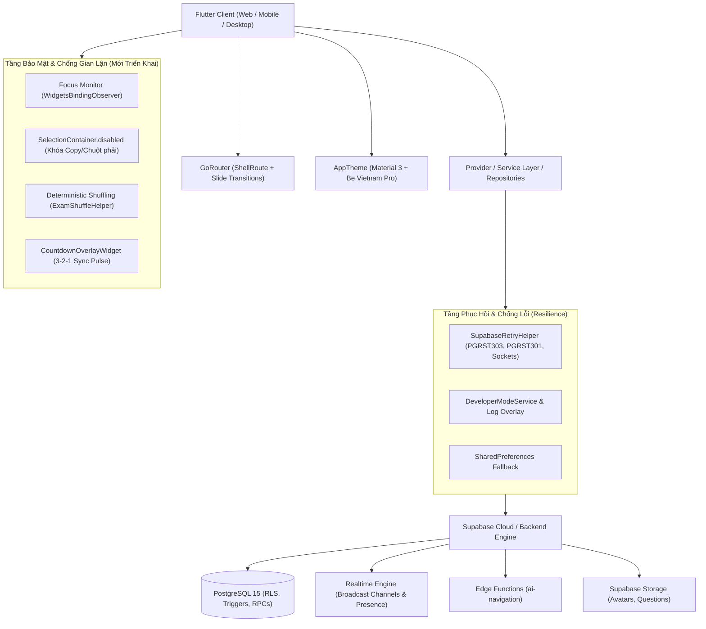

# BÁO CÁO ĐÁNH GIÁ TỔNG QUAN & CHI TIẾT TOÀN DIỆN HỆ THỐNG THI NHANH (ONTHI_COMMUNITY)

> **Ngày thực hiện:** 08/10/2026 *(Cập nhật chuẩn hóa sau khi hoàn tất loại bỏ Mock Data và nâng cao trải nghiệm điều hướng)*  
> **Phiên bản mã nguồn:** 1.0.0+1  
> **Trạng thái kiểm thử:** **173 / 173 bài kiểm thử tự động (Unit, Widget, E2E) đạt 100% PASS**  
> **Phạm vi đánh giá:** Toàn bộ mã nguồn `lib/`, `supabase/`, `test/`, `assets/`, tài liệu kiến trúc, hệ thống chống gian lận, điều hướng động và quy trình kiểm thử tự động.

---

## 1. TỔNG QUAN KIẾN TRÚC & CÔNG NGHỆ (SYSTEM ARCHITECTURE)

### 1.1. Công nghệ Cốt lõi
- **Framework Client:** Flutter (SDK ^3.10.0), Dart 3.x. Hỗ trợ đa nền tảng (Web, Windows, Android, iOS).
- **Backend & Database:** Supabase (PostgreSQL 15+), PostgREST RESTful API, Realtime Engine (WebSockets), Auth & Storage.
- **Quản lý Trạng thái:** Kết hợp `Provider` (`AuthProvider`), Service Pattern (`ProfileService`, `DeveloperModeService`, `AiNavigationService`) và Repository Pattern (`AssessmentRepository`, `TeacherExamRepository`, `RoomRepository`).
- **Điều hướng Tuyến đường:** `GoRouter` 17.3.0 với kiến trúc lồng ghép `ShellRoute` (chứa `TopNavBar` cố định cho các trang chính) kết hợp bộ chuyển cảnh `buildPageWithSlideTransition`.
- **Thiết kế & Typography:** Material 3, font chữ tiếng Việt chuẩn mực Google Fonts `Be Vietnam Pro`, bảng màu Violet/Ink cao cấp (`#6557E8`, `#24233A`), khả năng chống tràn `RenderFlex overflow` 100% trên màn hình nhỏ di động (360x640).
- **Công thức Toán & Đồ họa:** `flutter_math_fork` cho LaTeX, bộ biên dịch trực quan độc quyền `VisualMathCompiler` + `VisualMathBlock`, mã QR động `qr_flutter`.
- **Cơ chế Chống Gian Lận Đa Tầng (Anti-Cheat Engine):**
  - Giám sát trạng thái ứng dụng vòng đời thực (`WidgetsBindingObserver`), phát hiện rời app, chuyển tab hoặc thu nhỏ cửa sổ.
  - Xáo trộn câu hỏi và đáp án tất định theo seed ngẫu nhiên (`ExamShuffleHelper`).
  - Khóa sao chép văn bản câu hỏi và chặn bôi đen đề bài (`SelectionContainer.disabled`).
  - Đếm ngược toàn màn hình 3-2-1 đồng bộ (`CountdownOverlayWidget`).

---

## 2. BẢN ĐỒ KHU VỰC, TÍNH NĂNG & MÀN HÌNH (SCREENS & FEATURES)

### 2.1. Phân Hệ Xác Thực & Chào Đón (Auth & Onboarding)
1. **Màn hình Chào & Đăng nhập ([`GreetingScreen`](file:///c:/Users/ADMINE/Desktop/CODE/thi_nhanh/lib/screens/auth/greeting_screen.dart)):**
   - Đồ họa minh họa banner sách phát sáng (`glowing_book.png`, `clean_login_bg.png`).
   - Hỗ trợ đăng nhập Email/Mật khẩu, đăng ký tài khoản mới qua mã OTP gửi về Email, và chế độ **"Khách tham gia nhanh" (Guest Mode)** không cần đăng nhập.
2. **Khôi phục mật khẩu ([`ResetPasswordScreen`](file:///c:/Users/ADMINE/Desktop/CODE/thi_nhanh/lib/screens/auth/reset_password_screen.dart)):**
   - Luồng xác minh mã OTP gửi về Email bằng `EmailVerifier` và `OtpMailer` an toàn.

### 2.2. Phân Hệ Học Sinh (Student Experience)
1. **Trang chủ ([`HomeScreen`](file:///c:/Users/ADMINE/Desktop/CODE/thi_nhanh/lib/screens/home/home_screen.dart)):**
   - Danh mục 8 môn học phổ thông (Toán, Lý, Hóa, Sinh, Sử, Địa, GDCD, Tiếng Anh) với `TopicChip`.
   - Danh sách đề thi nổi bật, thanh tìm kiếm nhanh, nút AI Navigation điều hướng thông minh bằng ngôn ngữ tự nhiên.
   - **Điều hướng thông minh theo thời gian thực:** Thẻ "Bài Đang Làm" và "Phòng Đang Diễn Ra" tự động truy vấn `ProfileService` (`fetchActiveAttempt`, `fetchActiveLiveRoom`) để đưa học sinh quay lại đúng bài thi hoặc phòng thi đang dở dang mà không bị mất dữ liệu.
2. **Tìm kiếm & Bộ lọc ([`SearchScreen`](file:///c:/Users/ADMINE/Desktop/CODE/thi_nhanh/lib/screens/home/search_screen.dart)):**
   - Tìm kiếm đề thi theo từ khóa, môn học, mức độ khó (Dễ, Trung bình, Khó).
   - **Định dạng thời gian tương đối động:** Tích hợp `formatRelativeTime` tính toán tự động khoảng cách thời gian ("Vừa xong", "X phút trước", "X giờ trước", "X ngày trước") từ trường `created_at` thay vì chuỗi cứng.
3. **Chi tiết đề thi ([`ExamDetailScreen`](file:///c:/Users/ADMINE/Desktop/CODE/thi_nhanh/lib/screens/exam/exam_detail_screen.dart)):**
   - Tóm tắt thông tin đề, số lượng câu, thời gian làm bài, cấu trúc điểm và nút bắt đầu làm bài.
4. **Làm bài thi ([`TakingExamScreen`](file:///c:/Users/ADMINE/Desktop/CODE/thi_nhanh/lib/screens/exam/taking_exam_screen.dart)) — *Được Nâng Cấp Toàn Diện*:**
   - **Chống gian lận đa tầng (Focus Monitoring):** Tự động phát hiện học sinh chuyển tab trên trình duyệt hoặc chuyển sang ứng dụng khác trên điện thoại.
   - **Quy tắc phạt 4 cấp độ:** Cảnh báo nổi bật ở lần 1, lần 2; cảnh báo nguy cơ ở lần 3; và **tự động khóa bài cưỡng chế nộp bài** ở lần thứ 4.
   - **Khóa sao chép câu hỏi:** Sử dụng `SelectionContainer.disabled` ngăn chặn hoàn toàn việc bôi đen, sao chép nội dung hoặc click chuột phải tuồn đề ra ngoài.
   - **Xáo trộn ngẫu nhiên tất định (Deterministic Shuffling):** Tự động đảo thứ tự câu hỏi và đảo các đáp án A, B, C, D độc lập cho từng học sinh dựa theo seed (`attemptId`), đảm bảo nếu học sinh bị rớt mạng hay F5 tải lại trang thì thứ tự đề vẫn giữ nguyên vẹn.
   - Hỗ trợ câu hỏi đơn lựa chọn, đa lựa chọn, đúng/sai, render công thức toán LaTeX sắc nét.
   - Đồng hồ đếm ngược thời gian thực, lưu trữ cục bộ dự phòng (`SharedPreferences`) chống mất dữ liệu khi mất kết nối mạng.
5. **Kết quả & Bảng điểm ([`ResultScreen`](file:///c:/Users/ADMINE/Desktop/CODE/thi_nhanh/lib/screens/exam/result_screen.dart)):**
   - Hiển thị điểm số theo thang điểm 10, phân loại Đúng / Sai / Bỏ qua, gợi ý luyện tập lại câu sai.
6. **Luyện tập câu sai ([`WrongQuestionsPracticeScreen`](file:///c:/Users/ADMINE/Desktop/CODE/thi_nhanh/lib/screens/exam/wrong_questions_practice_screen.dart)):**
   - Tách riêng danh sách các câu làm sai từ bài thi trước đó để học sinh làm lại và xem lời giải chi tiết.
7. **Lịch sử làm bài ([`StudentHistoryScreen`](file:///c:/Users/ADMINE/Desktop/CODE/thi_nhanh/lib/screens/student/student_history_screen.dart)):**
   - Bảng điều khiển lịch sử đồ sộ: lọc theo thời gian (Hôm nay, 7 ngày, 30 ngày, tùy chọn), phân loại phòng thi / tự luyện, lọc môn học, thang điểm, sắp xếp, phân trang Google.
8. **Thành tích & Bảng xếp hạng ([`StudentAchievementsScreen`](file:///c:/Users/ADMINE/Desktop/CODE/thi_nhanh/lib/screens/student/student_achievements_screen.dart), [`StudentLeaderboardScreen`](file:///c:/Users/ADMINE/Desktop/CODE/thi_nhanh/lib/screens/student/student_leaderboard_screen.dart)):**
   - Hệ thống danh hiệu/huy hiệu (Chuỗi 5 bài, Điểm tuyệt đối, Phản xạ nhanh, Top 3) và vinh danh bảng vàng thành tích.
   - **Dữ liệu người dùng chuẩn hóa:** Loại bỏ triệt để email giả lập (`hocsinh@gmail.com`), tự động tra cứu tên hiển thị thực tế từ bảng `profiles` và gắn nhãn phân biệt người dùng vãng lai `(Khách)`.

### 2.3. Phân Hệ Giáo Viên & Quản Trị (Teacher Experience)
1. **Soạn thảo đề thi chuyên sâu ([`CreateExamScreen`](file:///c:/Users/ADMINE/Desktop/CODE/thi_nhanh/lib/screens/exam/create_exam_screen.dart)):**
   - **Inline Visual Math Editor:** Soạn công thức Toán học trực quan (phân số, lũy thừa, căn bậc hai, vecto) tự động compile sang LaTeX.
   - **Quick Bulk Import:** Nhập siêu tốc danh sách câu hỏi trắc nghiệm từ văn bản thô (dạng A. B. C. D.*).
   - **Student Exam Preview:** Xem trước giao diện đề thi dưới góc nhìn học sinh.
   - **Sidebar quản lý:** Cây câu hỏi trái/phải, tính điểm trọng số, gán thời gian riêng cho từng câu.
2. **Quản lý kho đề thi ([`TeacherExamsScreen`](file:///c:/Users/ADMINE/Desktop/CODE/thi_nhanh/lib/screens/teacher/teacher_exams_screen.dart)):**
   - Danh sách bản thảo (draft) và đề đã xuất bản (published), xác nhận xuất bản với checklist tiêu chuẩn.
3. **Quản lý & Lịch sử phòng thi ([`TeacherRoomsHistoryScreen`](file:///c:/Users/ADMINE/Desktop/CODE/thi_nhanh/lib/screens/teacher/teacher_rooms_history_screen.dart)):**
   - Tra cứu phòng thi theo 4 tab trạng thái (Tất cả, Đang diễn ra, Đang chờ, Đã kết thúc).
   - Sao chép mã phòng 1-click vào clipboard, phân trang Google, nút điều hướng ngữ cảnh tương ứng trạng thái phòng.
4. **Kết quả bài nộp của học sinh ([`TeacherStudentResultsScreen`](file:///c:/Users/ADMINE/Desktop/CODE/thi_nhanh/lib/screens/teacher/teacher_student_results_screen.dart)):**
   - Theo dõi kết quả làm bài của học sinh theo từng đề, hiển thị điểm số, thời gian nộp, tra cứu tức thì theo tên/môn.
   - Đã xử lý triệt để lỗi relationship schema PGRST200 và bổ sung cơ chế fallback trực tiếp an toàn.
5. **Báo cáo & Phân tích chuyên sâu ([`TeacherAnalyticsScreen`](file:///c:/Users/ADMINE/Desktop/CODE/thi_nhanh/lib/screens/teacher/teacher_analytics_screen.dart)):**
   - Điểm trung bình học sinh, tỷ lệ hoàn thành, phòng thi đông nhất, câu hỏi khó nhất cần ôn tập.

### 2.4. Phân Hệ Phòng Thi Trực Tiếp (Live Room & Realtime Ecosystem) — *Nâng Cấp Đột Phá*
1. **Tạo phòng thi ([`CreateRoomScreen`](file:///c:/Users/ADMINE/Desktop/CODE/thi_nhanh/lib/screens/room/create_room_screen.dart)):**
   - Đặt tên phòng, chọn đề thi từ kho, cài đặt mật khẩu phòng (tùy chọn), giới hạn số thí sinh, hẹn giờ mở phòng.
   - **Tùy chọn Bảo Mật Mới:** Bổ sung Card Material 3 với 2 switch:
     - `[x] Xáo trộn câu hỏi & đáp án`: Đảo vị trí ngẫu nhiên cho từng thí sinh (Mặc định: **BẬT**).
     - `[x] Giám sát chống gian lận`: Phát hiện chuyển tab/rời app, phạt tối đa 3 lần và thu bài ở lần 4 (Mặc định: **BẬT**).
2. **Phòng chờ Giáo viên ([`TeacherWaitingRoomScreen`](file:///c:/Users/ADMINE/Desktop/CODE/thi_nhanh/lib/screens/room/teacher_waiting_room_screen.dart)):**
   - Hiển thị danh sách thí sinh đang vào phòng theo thời gian thực (Realtime), chia sẻ mã QR phòng (`RoomQrDialog`), nút bấm bắt đầu thi đồng loạt hoặc đóng phòng thi.
3. **Phòng chờ Thí sinh ([`StudentWaitingRoomScreen`](file:///c:/Users/ADMINE/Desktop/CODE/thi_nhanh/lib/screens/room/student_waiting_room_screen.dart)):**
   - Danh sách bạn cùng thi theo thời gian thực.
   - **Khởi động đồng bộ kịch tính (Countdown Animation):** Tích hợp `CountdownOverlayWidget` hiển thị đếm ngược toàn màn hình `3` $\rightarrow$ `2` $\rightarrow$ `1` $\rightarrow$ `BẮT ĐẦU!` với hiệu ứng nhịp đập Pulse và Scale Transition ngay khi giáo viên phát lệnh mở đề, tạo tâm thế thi đấu kịch tính trước khi chuyển vào làm bài.
4. **Bảng theo dõi trực tiếp & Giám sát Vi phạm ([`LiveDashboardScreen`](file:///c:/Users/ADMINE/Desktop/CODE/thi_nhanh/lib/screens/exam/live_dashboard_screen.dart)):**
   - Giám sát tiến độ làm bài của từng học sinh trong thời gian thực (số câu đã làm, số câu đúng/sai, điểm số).
   - **Số liệu tiến độ thực tế:** Truy vấn tổng số câu hỏi từ bảng `questions` và đếm số câu đã trả lời từ bảng `attempt_answers` cho từng thí sinh, loại bỏ hoàn toàn các chỉ số giả lập (hardcoded `12/20/8/4`).
   - **Giám sát vi phạm trực tiếp:** Hiển thị trực tiếp cờ đỏ cảnh báo `🚩 X vi phạm` bên cạnh tên từng thí sinh theo thời gian thực nếu thí sinh rời màn hình làm bài, và gắn huy hiệu `⛔ Bị thu bài (Vi phạm quy chế)` nếu bị hệ thống cưỡng chế thu bài.

---

## 3. CƠ SỞ DỮ LIỆU & BACKEND (DATABASE, RPCS & SECURITY)

### 3.1. Thiết Kế Cơ Sở Dữ Liệu PostgreSQL

| Tên Bảng | Vai Trò & Mô Tả | Ràng Buộc & Khóa Ngoại |
| :--- | :--- | :--- |
| `teachers` | Hồ sơ giáo viên, người tạo đề | `owner_user_id` $\rightarrow$ `auth.users(id)` |
| `exams` | Đề thi (code dạng `DTxxxxxx`) | `teacher_id` $\rightarrow$ `teachers(id)`, `check(duration 1..360)` |
| `questions` | Câu hỏi trong đề | `exam_id` $\rightarrow$ `exams(id)` ON DELETE CASCADE, loại câu (`question_type`), thời gian, hình ảnh |
| `question_options` | Các phương án trả lời | `question_id` $\rightarrow$ `questions(id)` ON DELETE CASCADE, cờ `is_correct` |
| `rooms` | Phòng thi trực tiếp (code `PTxxxxxx`), lưu trữ cấu hình bảo mật `enable_anti_cheat`, `shuffle_questions` | `exam_id` $\rightarrow$ `exams(id)`, `teacher_id` $\rightarrow$ `teachers(id)`, mật khẩu băm, trạng thái |
| `attempts` | Lượt thi của học sinh/khách, lưu trữ điểm số, trạng thái vi phạm `violations_count` | `exam_id`, `room_id`, `user_id` $\rightarrow$ `auth.users(id)`, `guest_name`, điểm, thời gian nộp |
| `attempt_answers` | Chi tiết từng câu trả lời | `attempt_id` $\rightarrow$ `attempts(id)` ON DELETE CASCADE, `question_id`, `selected_option_id` |
| `profiles` | Hồ sơ người dùng dùng chung | `id` $\rightarrow$ `auth.users(id)`, `display_name`, `avatar_url` |
| `user_otps` | Quản lý mã OTP đăng ký / reset | Email, OTP băm, hạn hết hạn (TTL) |

### 3.2. Hệ Thống Stored Procedures & RPCs Tiêu Biểu
- `ensure_current_teacher()`: Xác minh giáo viên hiện tại một cách tự động và bảo mật.
- `save_teacher_exam_draft(...)`: Lưu bản thảo đề thi, hỗ trợ câu hỏi phong phú, đa lựa chọn và tính điểm tự động.
- `publish_teacher_exam(...)`: Xuất bản đề thi, đóng băng cấu trúc đề sau khi đã có người làm bài.
- `create_hosted_room(...)`: Khởi tạo phòng thi với mã phòng duy nhất `PTxxxxxx`.
- `start_teacher_room(...)` & `close_teacher_room(...)`: Quản lý vòng đời phòng thi theo thời gian thực.
- `join_student_room(...)`: Thí sinh tham gia phòng thi (hỗ trợ cả tài khoản chính thức và tài khoản khách).
- `submit_attempt(...)`: Thu bài, chấm điểm tự động dựa trên đáp án đúng và trọng số điểm.
- `get_room_leaderboard(...)`: Xếp hạng thí sinh theo điểm số và thời gian nộp bài.
- `teacher_profile_payload()`: Tổng hợp số liệu thống kê hồ sơ giáo viên trong 1 query duy nhất.

### 3.3. Bảo Mật & Phân Quyền (RLS - Row Level Security)
- **RLS Bật Trên Tất Cả Các Bảng:** Đảm bảo học sinh không thể truy vấn trái phép đáp án đúng (`question_options.is_correct`) khi chưa nộp bài.
- **RPC `security definer` với `set search_path = public`:** Chống tấn công chiếm quyền search_path, bảo vệ các giao dịch nhạy cảm như chấm điểm và mở/kết thúc phòng thi.

### 3.4. Tầng Resilience & Chống Lỗi Kỹ Thuật
- **`SupabaseRetryHelper`:** Tự động bắt và xử lý 3 loại sự cố phổ biến nhất trên môi trường production:
  1. `PGRST303 (JWT issued at future)`: Tự động tính toán độ lệch đồng hồ máy chủ và chờ thử lại.
  2. `PGRST301 (JWT expired)`: Tự động refresh phiên làm việc và gọi lại RPC.
  3. `SocketException / Connection closed`: Tự động thử lại với lũy thừa thời gian chờ (exponential backoff).
- **`DeveloperModeService` & `DeveloperLogOverlay`:** Ghi lại toàn bộ stack trace runtime và cung cấp màn hình theo dõi log trực tiếp ngay trong app.

---

## 4. STORAGE, ASSETS & LƯU TRỮ CỤC BỘ (STORAGE & CACHING)

1. **Supabase Storage:**
   - Bucket lưu trữ ảnh đại diện người dùng (`avatars`) và hình ảnh đính kèm câu hỏi thi (`question_images`).
   - `AvatarHelper` hỗ trợ đa định dạng thông minh: Network URL, Base64 URI, hoặc Memory Image với cơ chế fallback chữ cái đầu.
2. **Tài nguyên tĩnh ứng dụng (`assets/images/`):**
   - Đồ họa UI cao cấp: `books_left.png`, `books_right.png`, `clean_login_bg.png`, `glowing_book.png`, `google_logo.png`.
3. **Bộ nhớ cục bộ (`SharedPreferences`):**
   - Lưu trữ `active_user_email` duy trì đăng nhập.
   - Cơ chế lưu trữ offline bài làm thi `local_exam_attempts` khi thiết bị học sinh mất mạng lúc bấm nộp bài.

---

## 5. BẢNG ĐÁNH GIÁ ĐIỂM MẠNH & RỦI RO TIỀM ẨN

### 5.1. Điểm Mạnh Nổi Bật (Strengths)
1. **Kiến Trúc Hoàn Thiện & Tính Năng Chuyên Nghiệp:** Hệ thống sở hữu trọn vẹn luồng học tập từ A đến Z: Soạn đề thi Toán học với LaTeX trực quan $\rightarrow$ Cấu hình phòng thi bảo mật $\rightarrow$ Khởi động đếm ngược 3-2-1 $\rightarrow$ Thi trực tiếp có chống gian lận đa tầng $\rightarrow$ Chấm điểm tự động $\rightarrow$ Bảng xếp hạng Realtime $\rightarrow$ Luyện câu sai $\rightarrow$ Thống kê phân tích.
2. **Bảo Mật Học Thuật & Chống Gian Lận Hàng Đầu (New High-Water Mark):** Học sinh không thể copy đề bài ra ngoài, đề thi được xáo trộn thứ tự tất định cho từng người, và việc rời tab/chuyển ứng dụng được giám sát chặt chẽ với cơ chế cưỡng chế nộp bài ở lần thứ 4 và phát cờ đỏ trực tiếp lên dashboard của giáo viên.
3. **Khả Năng Chống Lỗi Tuyệt Vời (High Resilience):** Tầng `SupabaseRetryHelper` giải quyết triệt để vấn đề lệch đồng hồ và rớt mạng. Các màn hình đều có fallback bảng trực tiếp nếu RPC gặp sự cố.
4. **Trải Nghiệm Người Dùng (UX) & Thiết Kế Cao Cấp:** Giao diện nhất quán, đẹp mắt, font Be Vietnam Pro tối ưu tiếng Việt, phân trang Google, hỗ trợ màn hình siêu nhỏ không bao giờ bị RenderFlex overflow.
5. **Chất Lượng Kiểm Thử Tuyệt Đối:** Hệ thống hiện sở hữu **173 bài kiểm thử tự động (Unit, Widget, E2E)** đạt tỷ lệ thành công 100%, tuân thủ nghiêm ngặt chuẩn TDD.

### 5.2. Các Rủi Ro Tiềm Ẩn & Nút Thắt Cần Lưu Ý (Risks & Bottlenecks)

| Khu Vực | Rủi Ro / Vấn Đề Tiềm Ẩn | Hậu Quả Có Thể Xảy Ra | Đề Xuất Khắc Phục |
| :--- | :--- | :--- | :--- |
| **Realtime Subscriptions** | Sử dụng Realtime broadcast / postgres_changes khi phòng thi có hàng trăm học sinh | Có thể đạt hạn mức kết nối đồng thời của gói Supabase Free tier nếu phòng quá đông. | Sử dụng pooling hoặc batching progress updates thay vì phát tín hiệu liên tục mỗi giây. |
| **Bản Quyền Đề Thi** | Hiện tại đề thi lưu dạng văn bản công khai khi xuất bản | Giáo viên có thể muốn bảo mật đề thi chỉ dành riêng cho lớp học của mình. | Bổ sung cờ `is_private` và mã truy cập đề riêng tư (được giải quyết khi có phân hệ Quản lý Lớp học). |
| **Hỗ Trợ Ngoại Tuyến Đầy Đủ** | Mới lưu bài nộp offline, chưa hỗ trợ tải toàn bộ đề thi về máy trước khi thi | Học sinh vùng sâu vùng xa mạng yếu có thể bị gián đoạn giữa chừng khi tải đề. | Bổ sung SQLite/Isar để cache toàn bộ gói câu hỏi offline. |

---

## 6. TIẾN ĐỘ THỰC TẾ & LỘ TRÌNH ĐỀ XUẤT TIẾP THEO (PROGRESS & ROADMAP)

### 6.1. Hạng Mục Đã Hoàn Thành Toàn Diện (Completed)
- ✅ **Giai đoạn 1: Nâng cao Trải nghiệm Phòng thi & Chống Gian Lận (Enhanced Room & Anti-Cheat):**
  - [x] Hiệu ứng đếm ngược 3-2-1 đồng bộ (`CountdownOverlayWidget`) tại phòng chờ học sinh.
  - [x] Thuật toán xáo trộn câu hỏi và đáp án tất định theo seed (`ExamShuffleHelper`).
  - [x] Giám sát chuyển tab / rời màn hình 4 cấp độ cảnh báo và tự động thu bài (`TakingExamScreen`).
  - [x] Chặn bôi đen và khóa sao chép câu hỏi (`SelectionContainer.disabled`).
  - [x] Tùy chọn cấu hình bảo mật phòng thi tại `CreateRoomScreen`.
  - [x] Đồng bộ cờ đỏ vi phạm thời gian thực lên `LiveDashboardScreen` của giáo viên.
- ✅ **Giai đoạn 2: Quét Sạch Mock Data & Nâng Cao Trải Nghiệm Cốt Lõi (Mock Data Elimination & Core Polish):**
  - [x] Dọn dẹp store mồ côi `created_exam_store.dart` và route giả lập `/exam/physics-12`.
  - [x] Chuẩn hóa hiển thị thời gian tương đối động `formatRelativeTime` tại `SearchScreen`.
  - [x] Thay thế số liệu tiến độ giám sát hardcoded trong `LiveDashboardScreen` bằng truy vấn thực từ `questions` và `attempt_answers`.
  - [x] Triển khai điều hướng thông minh cho "Bài Đang Làm" và "Phòng Đang Diễn Ra" trên `HomeScreen`.
  - [x] Chuẩn hóa dữ liệu bảng xếp hạng `StudentLeaderboardScreen` (xóa fake email, phân giải `profiles`, nhãn `(Khách)`).
  - [x] 100% kiểm thử hồi quy đạt 173/173 tests PASS.

### 6.2. Lộ Trình Đề Xuất Tiếp Theo (Actionable Roadmap)
1. **Giai đoạn 3: Quản lý Lớp Học (Classroom Management) — Thiết kế Chuẩn hóa:**
   - Tái cấu trúc phân hệ Lớp học với kiến trúc chuẩn mực: thực thể `classes`, `class_members`, `class_assignments` với migration đồng bộ, đảm bảo tính toàn vẹn khóa ngoại và RLS trước khi kích hoạt.
2. **Giai đoạn 4: Xuất Báo Cáo & In Ấn (Exporting Suite):**
   - Tính năng xuất đề thi và đáp án ra file **PDF / Word (.docx)** có định dạng đẹp mắt để giáo viên in ra giấy khi thi trực tiếp trên lớp.
   - Xuất bảng điểm chi tiết của cả phòng thi ra file **Excel (.xlsx)** phục vụ vào sổ điểm nhà trường.
3. **Giai đoạn 5: Bộ Nhớ Đệm Ngoại Tuyến Toàn Phần (Offline-First Exam Cache):**
   - Tải trước toàn bộ gói đề thi vào bộ nhớ cục bộ SQLite/Isar để học sinh ở khu vực sóng yếu có thể làm bài hoàn toàn không bị gián đoạn.
