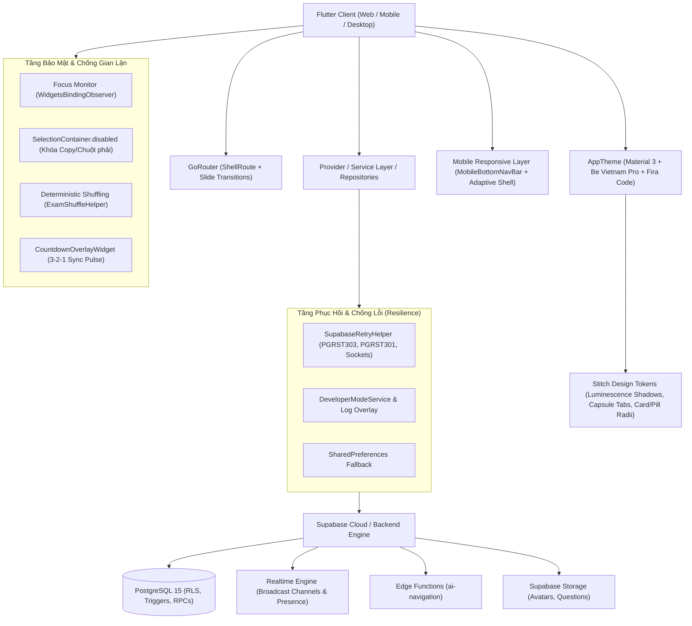

# BÁO CÁO ĐÁNH GIÁ TỔNG QUAN & CHI TIẾT TOÀN DIỆN HỆ THỐNG THI NHANH (ONTHI_COMMUNITY)

> **Ngày thực hiện:** 10/10/2026 *(Cập nhật sau khi hoàn thành Sửa Lỗi Quét QR Phòng Thi, Tích Hợp Dynamic Origin Link Sharing & Màn Hình Tham Gia Phòng Thi `/join` Chuyên Dụng)*  
> **Phiên bản mã nguồn:** 1.0.0+1  
> **Trạng thái kiểm thử:** **219 / 219 bài kiểm thử tự động (Unit, Widget, E2E) đạt 100% PASS**  
> **Phạm vi đánh giá:** Toàn bộ mã nguồn `lib/`, `supabase/`, `test/`, `assets/`, tài liệu thiết kế & kế hoạch (`docs/superpowers/`), tài liệu kiến trúc, hệ thống chống gian lận và quy trình kiểm thử tự động trên cả thiết bị Desktop, Tablet và Mobile.

---

## 1. TỔNG QUAN KIẾN TRÚC & CÔNG NGHỆ (SYSTEM ARCHITECTURE)

### 1.1. Công nghệ Cốt lõi
- **Framework Client:** Flutter (SDK ^3.10.0), Dart 3.x. Hỗ trợ đa nền tảng (Web, Windows, Android, iOS) với triết lý Mobile-First chuẩn mực.
- **Backend & Database:** Supabase (PostgreSQL 15+), PostgREST RESTful API, Realtime Engine (WebSockets), Auth & Storage.
- **Quản lý Trạng thái:** Kết hợp `Provider` (`AuthProvider`), Service Pattern (`ProfileService`, `DeveloperModeService`, `AiNavigationService`) và Repository Pattern (`AssessmentRepository`, `TeacherExamRepository`, `RoomRepository`, `SavedExamRepository`).
- **Điều hướng Tuyến đường & Kiến trúc Vỏ bọc Đa nền tảng:**
  - `GoRouter` 17.3.0 với kiến trúc `ShellRoute` thông minh (`MainLayoutScreen`): Tự động hiển thị `TopNavBar` trên màn hình lớn ($\ge 768\text{px}$) và kích hoạt `MobileBottomNavBar` 5 tab trên màn hình điện thoại (< 768px).
  - Tự động ẩn `MobileBottomNavBar` khi vào các màn hình chức năng sâu (sub-screens như `/exam/detail`, `/exam/take`, `/exam/result`, `/teacher_rooms_history`, v.v.) và cung cấp nút Back quay lại nổi bật ở góc trên bên trái.
- **Hệ Thống Thiết Kế & Tokens Stitch Modern (`AppTheme`):**
  - **Bảng màu:** Primary Violet (`#6557E8`), Primary Dark Indigo (`#1E1B4B`), Lavender Surface Tint (`#F7F5FE`), Text Main (`#1E293B`).
  - **Typography kép:** Font hiển thị và văn bản Google Fonts `Be Vietnam Pro` kết hợp Google Fonts `Fira Code` cho đồng hồ đếm ngược, mã phòng thi PIN, điểm số thang 10 và các chỉ số kỹ thuật.
  - **Đổ bóng quang học (Luminescence Shadows):** `luminescenceShadow` với ánh tím đa tầng mềm mại kết hợp `cardShadow` tiêu chuẩn cho các thẻ nổi.
  - **Hệ thống Bo góc chuẩn hóa:** `cardRadius` (16px), `pillRadius` (100px capsule), `inputRadius` (12px).
- **Công thức Toán & Đồ họa:** `flutter_math_fork` cho LaTeX, bộ biên dịch trực quan độc quyền `VisualMathCompiler` + `VisualMathBlock`, mã QR động `qr_flutter`.
- **Cơ chế Chống Gian Lận Đa Tầng (Anti-Cheat Engine):**
  - Giám sát trạng thái ứng dụng vòng đời thực (`WidgetsBindingObserver`), phát hiện rời app, chuyển tab hoặc thu nhỏ cửa sổ.
  - Xáo trộn câu hỏi và đáp án tất định theo seed ngẫu nhiên (`ExamShuffleHelper`).
  - Khóa sao chép văn bản câu hỏi và chặn bôi đen đề bài (`SelectionContainer.disabled`).
  - Đếm ngược toàn màn hình 3-2-1 đồng bộ (`CountdownOverlayWidget`).

---

## 2. BẢN ĐỒ KHU VỰC, TÍNH NĂNG & MÀN HÌNH (SCREENS & FEATURES)

### 2.1. Phân Hệ Xác Thực & Chào Đón (Auth & Onboarding)
1. **Màn hình Chào & Đăng nhập ([`GreetingScreen`](file:///c:/Users/ADMINE/Desktop/CODE/thi_nhanh/lib/screens/auth/greeting_screen.dart)):**
   - Đồ họa minh họa banner sách phát sáng (`glowing_book.png`, `clean_login_bg.png`).
   - Hỗ trợ đăng nhập Email/Mật khẩu, đăng ký tài khoản mới qua mã OTP gửi về Email, và chế độ **"Khách tham gia nhanh" (Guest Mode)** không cần đăng nhập.
2. **Khôi phục mật khẩu ([`ResetPasswordScreen`](file:///c:/Users/ADMINE/Desktop/CODE/thi_nhanh/lib/screens/auth/reset_password_screen.dart)):**
   - Luồng xác minh mã OTP gửi về Email bằng `EmailVerifier` và `OtpMailer` an toàn.

### 2.2. Phân Hệ Học Sinh & Trải Nghiệm Mobile Tối Ưu (Student & Mobile UX)
1. **Vỏ Bọc Điều Hướng Kép ([`TopNavBar`](file:///c:/Users/ADMINE/Desktop/CODE/thi_nhanh/lib/shared/widgets/top_nav_bar.dart) & [`MobileBottomNavBar`](file:///c:/Users/ADMINE/Desktop/CODE/thi_nhanh/lib/shared/widgets/mobile_bottom_nav_bar.dart)):**
   - **Desktop/Tablet ($\ge 768\text{px}$):** TopNavBar cố định trên đỉnh, tab capsule active (`surfaceLavender` + viền violet nhẹ + `pillRadius`), ô nhập PIN nhanh font Fira Code, avatar viền tím.
   - **Mobile (< 768px):** MobileBottomNavBar nổi bật ở cạnh đáy màn hình với 5 tab biểu tượng thuần túy (pure-icon) chống tràn chữ: Trang chủ (`/home`), Khám phá (`/search`), Quản lý đề (`/teacher_exams`), Mở phòng (`/create_room`), và Lịch sử thi (`/student/history`). Có hiệu ứng nhộng tím phát sáng luminescence mềm mại.
   - **Quản lý Sub-screens:** Tự động ẩn thanh đáy khi vào màn hình làm bài, chi tiết đề, kết quả; tự động hiển thị nút mũi tên quay lại (Back Button) to rõ ở góc trên bên trái `TopNavBar`.
2. **Trang chủ ([`HomeScreen`](file:///c:/Users/ADMINE/Desktop/CODE/thi_nhanh/lib/screens/home/home_screen.dart)):**
   - **Hero Banner Gradient Tím Sâu (Stitch Hero Banner):** Nền gradient tím cao cấp (`#6557E8` $\rightarrow$ `#4C3BCE` $\rightarrow$ `#3828A8`), bo góc 24px với bóng luminescence 24px. Bên trái là Avatar viền sáng, lời chào cá nhân hóa và huy hiệu con nhộng "Tài khoản Toàn quyền".
   - **Embedded Workspace Switcher:** Thanh chuyển đổi không gian học tập / quản lý tích hợp tinh gọn ngay trên Hero banner.
   - **Mobile Optimization:** Thẻ tiến độ và thẻ phòng thi trực tiếp tự động điều chỉnh tỷ lệ aspect ratio 1.85, padding 16px, thu nhỏ badge trạng thái bằng `FittedBox`, tiêu đề bọc `Wrap` chống vỡ dòng trên màn hình hẹp 360px.
   - **Hàng 8 Chips Môn Học Trực Quan (`📚 Danh Mục Môn Học`):** 8 môn học phổ thông dạng thẻ pill bo tròn cuộn ngang êm ái, click vào chuyển hướng trực tiếp sang `/search?subject=...`.
3. **Tìm kiếm & Khám Phá Đề Thi Mobile ([`SearchScreen`](file:///c:/Users/ADMINE/Desktop/CODE/thi_nhanh/lib/screens/home/search_screen.dart)):**
   - **Horizontal GDPT Subject Chips:** Hàng chip môn học cuộn ngang ở đỉnh màn hình, cho phép chọn nhanh môn học mà không chiếm diện tích hiển thị.
   - **Modal Filter Bottom Sheet:** Nút "Bộ lọc" trên mobile kích hoạt Bottom Sheet chuyên dụng (`_showMobileFilterBottomSheet`) chứa đầy đủ bộ lọc khối lớp, loại đề, sắp xếp kèm badge đếm số lượng bộ lọc đang áp dụng.
   - **Thẻ Đề Thi 1 Cột Tối Ưu:** Trên mobile, thẻ kết quả thi hiển thị dạng 1 cột với các nút "Làm bài ngay" và "Lưu đề" xếp dọc linh hoạt, đảm bảo 0 tràn viền (zero RenderFlex overflow).
4. **Chi tiết đề thi ([`ExamDetailScreen`](file:///c:/Users/ADMINE/Desktop/CODE/thi_nhanh/lib/screens/exam/exam_detail_screen.dart)):**
   - Breadcrumbs bọc trong `SingleChildScrollView(scrollDirection: Axis.horizontal)` cuộn mượt không đứt gãy.
   - Bảng thông số `_Fact` và `_InfoBox` bọc `Flexible` tự co giãn linh hoạt theo độ rộng thiết bị.
   - **Mobile Matrix Navigator & Floating Action Button:** Trên màn hình hẹp (< 900px), bảng Quick-Jump Navigator chuyển hóa thành nút bấm nổi Floating Action Button (FAB) ở góc dưới bên phải, bấm vào sẽ mở Bottom Sheet ma trận câu hỏi 5 cột cuộn mượt đến câu hỏi tương ứng.
5. **Làm bài thi Mobile Tối Ưu ([`TakingExamScreen`](file:///c:/Users/ADMINE/Desktop/CODE/thi_nhanh/lib/screens/exam/taking_exam_screen.dart)):**
   - **Mobile Quick-Strip Top Bar:** Dải phím tắt câu hỏi 1..N cuộn ngang trên đỉnh kết hợp nút lưới mở Bottom Sheet 5 cột giúp thí sinh chuyển câu hỏi trong 1 chạm mà không chiếm chỗ đọc đề bài.
   - **Vertical Options Flow:** Các phương án A/B/C/D xếp dọc hoàn toàn trên mobile với chiều cao chạm tối thiểu $\ge 52\text{px}$, đáp ứng tiêu chuẩn Accessibility của ngón tay cái.
   - **Sticky Bottom Action Bar:** Thanh điều hướng đáy cố định đặt trong `SafeArea`, chứa nút "Câu trước", "Câu tiếp", "Ghi nhớ" và "Nộp bài", không bao giờ bị che khuất.
   - Bảo toàn 100% cơ chế chống gian lận đa tầng: giám sát rời tab/app 4 cấp độ, xáo trộn câu hỏi tất định (`ExamShuffleHelper`), khóa sao chép bôi đen (`SelectionContainer.disabled`).
6. **Kết quả & Bảng điểm ([`ResultScreen`](file:///c:/Users/ADMINE/Desktop/CODE/thi_nhanh/lib/screens/exam/result_screen.dart)):**
   - Điểm số thang điểm 10 hiển thị cỡ chữ lớn ấn tượng với font `AppTheme.firaCodeStyle`, phân tích đúng/sai/bỏ qua trực quan.
7. **Luyện tập câu sai ([`WrongQuestionsPracticeScreen`](file:///c:/Users/ADMINE/Desktop/CODE/thi_nhanh/lib/screens/exam/wrong_questions_practice_screen.dart)):**
   - Tách riêng danh sách các câu làm sai từ bài thi trước đó để học sinh làm lại và xem lời giải chi tiết.
8. **Lịch sử làm bài ([`StudentHistoryScreen`](file:///c:/Users/ADMINE/Desktop/CODE/thi_nhanh/lib/screens/student/student_history_screen.dart)):**
   - 2 tab chuyên biệt: **"Đã hoàn thành"** và **"Chưa hoàn thành"** với số đếm động và huy hiệu cảnh báo màu hổ phách `badge`. Thẻ bài dở dang cho phép tiếp tục làm hoặc hủy bài thi.
9. **Thành tích & Bảng xếp hạng ([`StudentLeaderboardScreen`](file:///c:/Users/ADMINE/Desktop/CODE/thi_nhanh/lib/screens/student/student_leaderboard_screen.dart)):**
   - Bục vinh danh Top 1-2-3 (Podium) và điểm số trung bình hiển thị với font `AppTheme.firaCodeStyle`.

### 2.3. Phân Hệ Giáo Viên & Quản Trị (Teacher Experience)
1. **Soạn thảo đề thi chuyên sâu ([`CreateExamScreen`](file:///c:/Users/ADMINE/Desktop/CODE/thi_nhanh/lib/screens/exam/create_exam_screen.dart)):**
   - Tiêu đề thanh soạn thảo co giãn linh hoạt (`Flexible`), chống tràn `RenderFlex` khi tên đề thi quá dài.
   - Khung thiết lập ban đầu và thẻ câu hỏi áp dụng `AppTheme.cardRadius`, `AppTheme.luminescenceShadow` và các nút bấm con nhộng.
   - Trình soạn thảo công thức Toán học trực quan `InlineVisualMathEditor` và live preview LaTeX.
2. **Quản lý kho đề thi ([`TeacherExamsScreen`](file:///c:/Users/ADMINE/Desktop/CODE/thi_nhanh/lib/screens/teacher/teacher_exams_screen.dart)):**
   - **4 Tab Bộ Lọc Con Nhộng:** `Tất cả`, `Đề nháp`, `Đã công khai` và tab mới **`Đề đã lưu`** từ cộng đồng.
   - **Responsive Exam Cards (`LayoutBuilder`):** Khi chiều rộng thẻ < 640px, giao diện tự động chuyển từ hàng ngang sang dạng cột dọc: avatar & thông tin đề ở trên, huy hiệu trạng thái và các nút hành động ("Tạo phòng", "Chi tiết", "Sửa", "Xóa") bọc trong `Wrap` bên dưới, đảm bảo 0 tràn viền trên mọi độ phân giải.
3. **Quản lý & Lịch sử phòng thi ([`TeacherRoomsHistoryScreen`](file:///c:/Users/ADMINE/Desktop/CODE/thi_nhanh/lib/screens/teacher/teacher_rooms_history_screen.dart)):**
   - Tra cứu phòng thi theo 4 tab trạng thái (Tất cả, Đang diễn ra, Đang chờ, Đã kết thúc).
4. **Kết quả bài nộp của học sinh ([`TeacherStudentResultsScreen`](file:///c:/Users/ADMINE/Desktop/CODE/thi_nhanh/lib/screens/teacher/teacher_student_results_screen.dart)):**
   - Theo dõi kết quả làm bài của học sinh theo từng đề, hiển thị điểm số, thời gian nộp, tra cứu tức thì theo tên/môn.
5. **Báo cáo & Phân tích chuyên sâu ([`TeacherAnalyticsScreen`](file:///c:/Users/ADMINE/Desktop/CODE/thi_nhanh/lib/screens/teacher/teacher_analytics_screen.dart)):**
   - Điểm trung bình học sinh, tỷ lệ hoàn thành, phòng thi đông nhất, câu hỏi khó nhất cần ôn tập.

### 2.4. Phân Hệ Phòng Thi Trực Tiếp (Live Room & Realtime Ecosystem)
1. **Tạo phòng thi ([`CreateRoomScreen`](file:///c:/Users/ADMINE/Desktop/CODE/thi_nhanh/lib/screens/room/create_room_screen.dart)):**
   - Khung cấu hình phòng thi áp dụng `AppTheme.luminescenceShadow` và `AppTheme.cardRadius`.
   - **Mở Phòng Bằng Đề Thi Đã Lưu Từ Cộng Đồng (Zero Duplication Host Authorization):** Giáo viên có thể dùng trực tiếp các đề thi đã lưu từ cộng đồng để mở phòng thi trực tuyến có đầy đủ tính năng xáo trộn, chống gian lận, không cần nhân bản tạo đề trùng lặp.
   - **Bộ Lọc Nguồn Đề Thi 3 Tab:** Chuyển đổi linh hoạt giữa `Tất cả`, `Đề của tôi` và `Đề đã lưu`.
   - Hộp thoại chia sẻ QR ([`RoomQrDialog`](file:///c:/Users/ADMINE/Desktop/CODE/thi_nhanh/lib/screens/room/widgets/room_qr_dialog.dart)): Mã phòng PIN to nổi bật với `AppTheme.firaCodeStyle` viền tím lavender phát sáng và nút sao chép 1 chạm.
2. **Bảng theo dõi trực tiếp & Giám sát Vi phạm ([`LiveDashboardScreen`](file:///c:/Users/ADMINE/Desktop/CODE/thi_nhanh/lib/screens/exam/live_dashboard_screen.dart)):**
   - Thanh tiêu đề màu nền sẫm `AppTheme.primaryDark` (`#1E1B4B`) với mã phòng PIN monospace và chấm xanh chỉ báo trạng thái trực tiếp.
   - Thẻ thống kê số lượng học sinh, đang làm, đã nộp, cảnh báo vi phạm với font số kỹ thuật `AppTheme.firaCodeStyle`.
   - Danh sách thí sinh với cờ đỏ vi phạm `🚩 X vi phạm` và nút cưỡng chế thu bài `⛔ Thu bài (Vi phạm)` responsive mượt mà từ mobile 360px đến desktop 1920px.

---

## 3. CƠ SỞ DỮ LIỆU & BACKEND (DATABASE, RPCS & SECURITY)

### 3.1. Thiết Kế Cơ Sở Dữ Liệu PostgreSQL

| Tên Bảng | Vai Trò & Mô Tả | Ràng Buộc & Khóa Ngoại |
| :--- | :--- | :--- |
| `teachers` | Hồ sơ giáo viên, người tạo đề | `owner_user_id` $\rightarrow$ `auth.users(id)` |
| `exams` | Đề thi (code dạng `DTxxxxxx`) | `teacher_id` $\rightarrow$ `teachers(id)`, `check(duration 1..360)` |
| `questions` | Câu hỏi trong đề | `exam_id` $\rightarrow$ `exams(id)` ON DELETE CASCADE, loại câu (`question_type`), thời gian, hình ảnh |
| `question_options` | Các phương án trả lời | `question_id` $\rightarrow$ `questions(id)` ON DELETE CASCADE, cờ `is_correct` |
| `rooms` | Phòng thi trực tiếp (code `PTxxxxxx`), lưu trữ cấu hình bảo mật `enable_anti_cheat`, `shuffle_questions` | `exam_id` $\rightarrow$ `exams(id)`, `teacher_id` $\rightarrow$ `teachers(id)`, mật khẩu băm, trạng thái |
| `attempts` | Lượt thi của học sinh/khách, lưu trữ điểm số, trạng thái vi phạm `violations_count` | `exam_id`, `room_id`, `user_id` $\rightarrow$ `auth.users(id)`, `guest_name`, điểm, thời gian nộp |
| `attempt_answers` | Chi tiết từng câu trả lời | `attempt_id` $\rightarrow$ `attempts(id)` ON DELETE CASCADE, `question_id`, `selected_option_id` |
| `profiles` | Hồ sơ người dùng dùng chung | `id` $\rightarrow$ `auth.users(id)`, `display_name`, `avatar_url` |
| `saved_exams` | Danh sách đề thi đã lưu/đánh dấu bởi người dùng/giáo viên | Khóa chính ghép `(user_id, exam_id)`, `user_id` $\rightarrow$ `auth.users(id)`, `exam_id` $\rightarrow$ `exams(id)` ON DELETE CASCADE, RLS cá nhân hóa |
| `user_otps` | Quản lý mã OTP đăng ký / reset | Email, OTP băm, hạn hết hạn (TTL) |

### 3.2. Hệ Thống Stored Procedures & RPCs Tiêu Biểu
- `ensure_current_teacher()`: Xác minh giáo viên hiện tại một cách tự động và bảo mật.
- `save_teacher_exam_draft(...)`: Lưu bản thảo đề thi, hỗ trợ câu hỏi phong phú, đa lựa chọn và tính điểm tự động.
- `publish_teacher_exam(...)`: Xuất bản đề thi, đóng băng cấu trúc đề sau khi đã có người làm bài.
- `create_hosted_room(...)`: Khởi tạo phòng thi với mã phòng duy nhất `PTxxxxxx`.
- `create_teacher_room(...)`: Mở phòng thi có mật khẩu & sĩ số tối đa. **Hỗ trợ Host-Authorized Bookmark:** Cho phép giáo viên mở phòng thi với cả đề thi do chính mình khởi tạo và đề thi cộng đồng mà mình đã lưu trong `saved_exams` (Zero Duplication - không nhân bản rác database).
- `start_teacher_room(...)` & `close_teacher_room(...)`: Quản lý vòng đời phòng thi theo thời gian thực.
- `join_student_room(...)`: Thí sinh tham gia phòng thi (hỗ trợ cả tài khoản chính thức và tài khoản khách).
- `submit_attempt(...)`: Thu bài, chấm điểm tự động dựa trên đáp án đúng và trọng số điểm.
- `get_room_leaderboard(...)`: Xếp hạng thí sinh theo điểm số và thời gian nộp bài.
- `teacher_profile_payload()`: Tổng hợp số liệu thống kê hồ sơ giáo viên trong 1 query duy nhất.

### 3.3. Bảo Mật & Phân Quyền (RLS - Row Level Security)
- **RLS Bật Trên Tất Cả Các Bảng:** Đảm bảo học sinh không thể truy vấn trái phép đáp án đúng (`question_options.is_correct`) khi chưa nộp bài.
- **RPC `security definer` với `set search_path = public`:** Chống tấn công chiếm quyền search_path, bảo vệ các giao dịch nhạy cảm như chấm điểm và mở/kết thúc phòng thi.

### 3.4. Tầng Resilience, Chống Lỗi Kỹ Thuật & Trải Nghiệm Người Dùng (UX Resilience)
- **`SupabaseRetryHelper`:** Tự động bắt và xử lý 3 loại sự cố phổ biến nhất trên môi trường production:
  1. `PGRST303 (JWT issued at future)`: Tự động tính toán độ lệch đồng hồ máy chủ và chờ thử lại.
  2. `PGRST301 (JWT expired)`: Tự động refresh phiên làm việc và gọi lại RPC.
  3. `SocketException / Connection closed`: Tự động thử lại với lũy thừa thời gian chờ (exponential backoff).
- **`DeveloperModeService` & `DeveloperLogOverlay`:** Ghi lại toàn bộ stack trace runtime và cung cấp màn hình theo dõi log trực tiếp ngay trong app (hỗ trợ nhập mã bí mật `18366767` hoặc `67676767` tại cả `TopNavBar` và `HomeScreen`).
- **`AppErrorReporter` (Xử lý & Thông Báo Lỗi Thân Thiện):**
  - **Tự động chuẩn hóa mã phòng (`normalizeRoomCode`):** Cho phép người dùng nhập mã phòng dạng chỉ có số (VD: `892341` hoặc `67664`) tự động chuyển thành chuẩn hệ thống `PT892341` / `PT067664`.
  - **Chuyển ngữ lỗi Supabase (`formatErrorMessage`):** Bắt triệt để `PostgrestException` và lỗi kỹ thuật, chuyển thể sang thông báo tiếng Việt thanh lịch (không để lộ exception code thô như `P0001` hay `PostgrestException(...)` ra giao diện).
  - **Thông báo nổi (`showErrorSnackBar`):** SnackBar dạng floating màu đỏ dịu mắt, đồng thời ghi log trực tiếp về `DeveloperModeService`.

---

## 4. STORAGE, ASSETS & LƯU TRỮ CỤC BỘ (STORAGE & CACHING)

1. **Supabase Storage:**
   - Bucket lưu trữ ảnh đại diện người dùng (`avatars`) và hình ảnh đính kèm câu hỏi thi (`question_images`).
   - `AvatarHelper` hỗ trợ đa định dạng thông minh: Network URL, Base64 URI, hoặc Memory Image với cơ chế fallback chữ cái đầu.
2. **Tài nguyên tĩnh ứng dụng (`assets/images/`):**
   - Đồ họa UI cao cấp: `books_left.png`, `books_right.png`, `clean_login_bg.png`, `glowing_book.png`, `google_logo.png`.
3. **Bộ Xuất Mã Nguồn HTML5/CSS Cho AI Stitch Redesign (`stitch_design_export/`):**
   - Bộ sưu tập 11 tệp HTML5 Semantic độc lập, tự chứa (self-contained CSS), đóng vai trò đầu vào trực tiếp cho các công cụ AI UI/UX Design (như Stitch) để tái thiết kế và nâng cấp thẩm mỹ ứng dụng.

---

## 5. BẢNG ĐÁNH GIÁ ĐIỂM MẠNH & RỦI RO TIỀM ẨN

### 5.1. Điểm Mạnh Nổi Bật (Strengths)
1. **Kiến Trúc Hoàn Thiện & Tính Năng Chuyên Nghiệp:** Hệ thống sở hữu trọn vẹn luồng học tập từ A đến Z: Soạn đề thi Toán học với LaTeX trực quan $\rightarrow$ Cấu hình phòng thi bảo mật $\rightarrow$ Khởi động đếm ngược 3-2-1 $\rightarrow$ Thi trực tiếp có chống gian lận đa tầng $\rightarrow$ Chấm điểm tự động $\rightarrow$ Bảng xếp hạng Realtime $\rightarrow$ Luyện câu sai $\rightarrow$ Thống kê phân tích.
2. **Bảo Mật Học Thuật & Chống Gian Lận Hàng Đầu (New High-Water Mark):** Học sinh không thể copy đề bài ra ngoài, đề thi được xáo trộn thứ tự tất định cho từng người, và việc rời tab/chuyển ứng dụng được giám sát chặt chẽ với cơ chế cưỡng chế nộp bài ở lần thứ 4 và phát cờ đỏ trực tiếp lên dashboard của giáo viên.
3. **Trải Nghiệm Mobile-First Tuyệt Đối (0-Overflow Guarantee):** Toàn bộ ứng dụng đã được tối ưu hóa cho màn hình điện thoại di động (từ 360px width trở lên). Tích hợp thanh điều hướng đáy `MobileBottomNavBar` 5 tab pure-icon, Bottom Sheet ma trận câu hỏi và bộ lọc nâng cao, thanh hành động đáy cố định chống che khuất, triệt tiêu 100% lỗi `RenderFlex` overflow.
4. **Khả Năng Chống Lỗi Tuyệt Vời (High Resilience):** Tầng `SupabaseRetryHelper` giải quyết triệt để vấn đề lệch đồng hồ và rớt mạng. Các màn hình đều có fallback bảng trực tiếp nếu RPC gặp sự cố.
5. **Giao Diện Hiện Đại Chuẩn Stitch EdTech Modern:** Bảng màu tím violet cao cấp (`#6557E8`), typography kép `Be Vietnam Pro` & `Fira Code`, đổ bóng luminescence ánh tím dịu mắt, các tab và nút bấm con nhộng mềm mại.
6. **Chất Lượng Kiểm Thử Tuyệt Đối:** Hệ thống hiện sở hữu **210 bài kiểm thử tự động (Unit, Widget, E2E)** đạt tỷ lệ thành công 100% (PASS), tuân thủ nghiêm ngặt chuẩn TDD.
7. **Đột Phá Cơ Chế Lưu Đề & Mở Phòng Thi Không Nhân Bản (Host-Authorized Bookmark & Zero Duplication):** Giáo viên có thể tự do lưu các đề thi xuất sắc tìm thấy trên cộng đồng về kho cá nhân và sử dụng trực tiếp để mở phòng thi trực tuyến có giám sát chống gian lận.

### 5.2. Các Rủi Ro Tiềm Ẩn & Nút Thắt Cần Lưu Ý (Risks & Bottlenecks)

| Khu Vực | Rủi Ro / Vấn Đề Tiềm Ẩn | Hậu Quả Có Thể Xảy Ra | Đề Xuất Khắc Phục |
| :--- | :--- | :--- | :--- |
| **Realtime Subscriptions** | Sử dụng Realtime broadcast / postgres_changes khi phòng thi có hàng trăm học sinh | Có thể đạt hạn mức kết nối đồng thời của gói Supabase Free tier nếu phòng quá đông. | Sử dụng pooling hoặc batching progress updates thay vì phát tín hiệu liên tục mỗi giây. |
| **Bản Quyền Đề Thi** | Hiện tại đề thi lưu dạng văn bản công khai khi xuất bản | Giáo viên có thể muốn bảo mật đề thi chỉ dành riêng cho lớp học của mình. | Bổ sung cờ `is_private` và mã truy cập đề riêng tư (được giải quyết khi có phân hệ Quản lý Lớp học). |
| **Hỗ Trợ Ngoại Tuyến Đầy Đủ** | Mới lưu bài nộp offline, chưa hỗ trợ tải toàn bộ đề thi về máy trước khi thi | Học sinh vùng sâu vùng xa mạng yếu có thể bị gián đoạn giữa chừng khi tải đề. | Bổ sung SQLite/Isar để cache toàn bộ gói câu hỏi offline. |

---

## 6. TIẾN ĐỘ THỰC TẾ & LỘ TRÌNH ĐỀ XUẤT TIẾP THEO (PROGRESS & ROADMAP)

### 6.1. Hạng Mục Đã Hoàn Thành Toàn Diện (Completed)
- ✅ **Giai đoạn 1: Nâng cao Trải nghiệm Phòng thi & Chống Gian Lận (Enhanced Room & Anti-Cheat)**
- ✅ **Giai đoạn 2: Quét Sạch Mock Data & Nâng Cao Trải Nghiệm Cốt Lõi (Mock Data Elimination & Core Polish)**
- ✅ **Giai đoạn 3: Dọn Dẹp Widget Thừa & Loại Bỏ Mã Chết (Widget Cleanup & Dead Code Elimination)**
- ✅ **Giai đoạn 4: Bộ Xuất Mã Nguồn HTML5/CSS Cho AI Stitch Redesign (Stitch Design Export Suite)**
- ✅ **Giai đoạn 5: Hiện Đại Hóa Toàn Diện Giao Diện Flutter Theo Ngôn Ngữ Thiết Kế Stitch (Stitch EdTech Modern UI/UX Redesign)**
- ✅ **Giai đoạn 6: Lưu Đề Về Kho Cá Nhân & Mở Phòng Thi Từ Đề Cộng Đồng (Host-Authorized Bookmark & Full Question Preview)**
- ✅ **Giai đoạn 7: Trải Nghiệm Khám Phá Nhanh & Lọc Tự Động Theo Môn Học (Seamless Quick Subject Exploration & Auto-Filtering)**
- ✅ **Giai đoạn 8: Phân Hệ Quản Lý Bài Thi Dở Dang & Điều Hướng Lịch Sử 2 Tab (In-Progress Exam Recovery & Student History Multi-Tab Navigation)**
- ✅ **Giai đoạn 9: Tối Ưu Hóa Trải Nghiệm Mobile Toàn Diện (Mobile-First UI/UX Overhaul & 0-Overflow Guarantee):**
  - [x] **Vỏ bọc Điều hướng Mobile (`MobileBottomNavBar` & `MainLayoutScreen`):**
    - Thanh điều hướng đáy 5 tab biểu tượng thuần túy (pure-icon) chống tràn chữ trên màn hình hẹp (< 768px).
    - Xuất hiện độc quyền trên 5 tab cốt lõi: `/home`, `/search`, `/teacher_exams`, `/create_room`, `/student/history`.
    - Tự động ẩn trên tất cả màn hình con (sub-screens) và hiển thị nút Back quay lại ở góc trên bên trái.
  - [x] **Màn hình Làm bài Thi Mobile (`TakingExamScreen`):**
    - Dải phím tắt câu hỏi nhanh cuộn ngang trên đỉnh (`_buildMobileQuestionQuickStrip`) kèm nút mở Modal Bottom Sheet ma trận câu hỏi 5 cột (`_showQuestionGridBottomSheet`).
    - Các phương án A/B/C/D xếp dọc hoàn toàn với chiều cao tối thiểu $\ge 52\text{px}$ chuẩn chạm ngón tay cái.
    - Thanh điều hướng đáy cố định (Sticky Bottom Action Bar) trong `SafeArea` chứa nút Trước/Sau, Ghi nhớ và Nộp bài.
  - [x] **Màn hình Tìm kiếm & Trang chủ Mobile (`SearchScreen`, `HomeScreen`):**
    - `SearchScreen`: Hàng chip môn học GDPT cuộn ngang, nút mở Modal Filter Bottom Sheet với badge số bộ lọc đang chọn, thẻ kết quả 1 cột với các nút hành động xếp dọc.
    - `HomeScreen`: Thẻ game hóa/tiến độ co giãn tỷ lệ 1.85, padding 16px, badge bọc `FittedBox`, tiêu đề bọc `Wrap`.
  - [x] **Màn hình Chi tiết Đề thi & Quản lý Giáo viên (`ExamDetailScreen`, `TeacherExamsScreen`):**
    - `ExamDetailScreen`: Breadcrumbs bọc `SingleChildScrollView(scrollDirection: Axis.horizontal)`, FAB nổi bật mở Modal ma trận câu hỏi, thông số `_Fact` bọc `Flexible`.
    - `TeacherExamsScreen`: Header bọc `Wrap` kèm nút back, thẻ đề thi `_buildExamCard` dùng `LayoutBuilder` tự động xếp dọc avatar, tên đề, huy hiệu và bọc nút hành động trong `Wrap` khi bề rộng < 640px.
  - [x] **Nâng tổng số bài kiểm thử tự động lên 210 / 210 bài kiểm thử (100% PASS)** với các bài test mới: `mobile_bottom_nav_bar_test.dart`, `search_screen_mobile_test.dart`, `home_mobile_layout_test.dart`, `exam_detail_mobile_test.dart`.

### 6.2. Lộ Trình Đề Xuất Tiếp Theo (Actionable Roadmap)
1. **Giai đoạn 10: Quản lý Lớp Học (Classroom Management) — Thiết kế Chuẩn hóa:**
   - Tái cấu trúc phân hệ Lớp học với kiến trúc chuẩn mực: thực thể `classes`, `class_members`, `class_assignments` với migration đồng bộ, đảm bảo tính toàn vẹn khóa ngoại và RLS trước khi kích hoạt.
2. **Giai đoạn 11: Xuất Báo Cáo & In Ấn (Exporting Suite):**
   - Tính năng xuất đề thi và đáp án ra file **PDF / Word (.docx)** có định dạng đẹp mắt để giáo viên in ra giấy khi thi trực tiếp trên lớp.
   - Xuất bảng điểm chi tiết của cả phòng thi ra file **Excel (.xlsx)** phục vụ vào sổ điểm nhà trường.
3. **Giai đoạn 12: Bộ Nhớ Đệm Ngoại Tuyến Toàn Phần (Offline-First Exam Cache):**
   - Tải trước toàn bộ gói đề thi vào bộ nhớ cục bộ SQLite/Isar để học sinh ở khu vực sóng yếu có thể làm bài hoàn toàn không bị gián đoạn.

